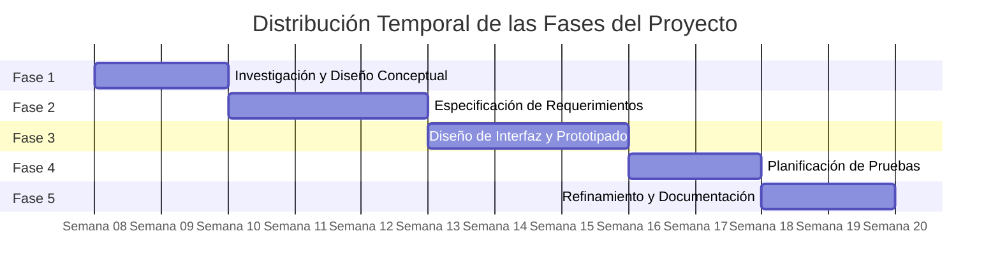
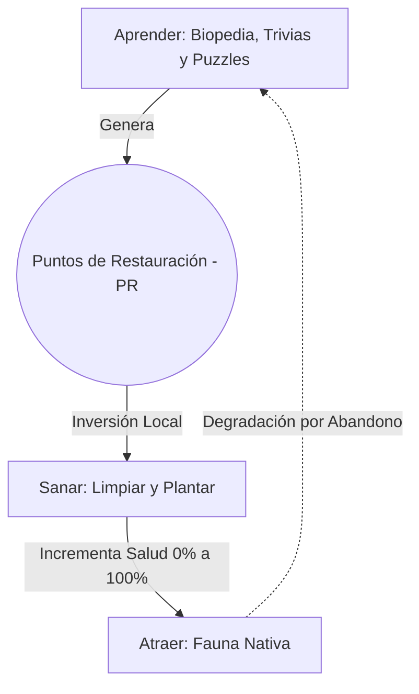
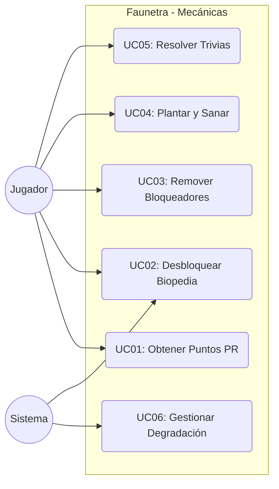
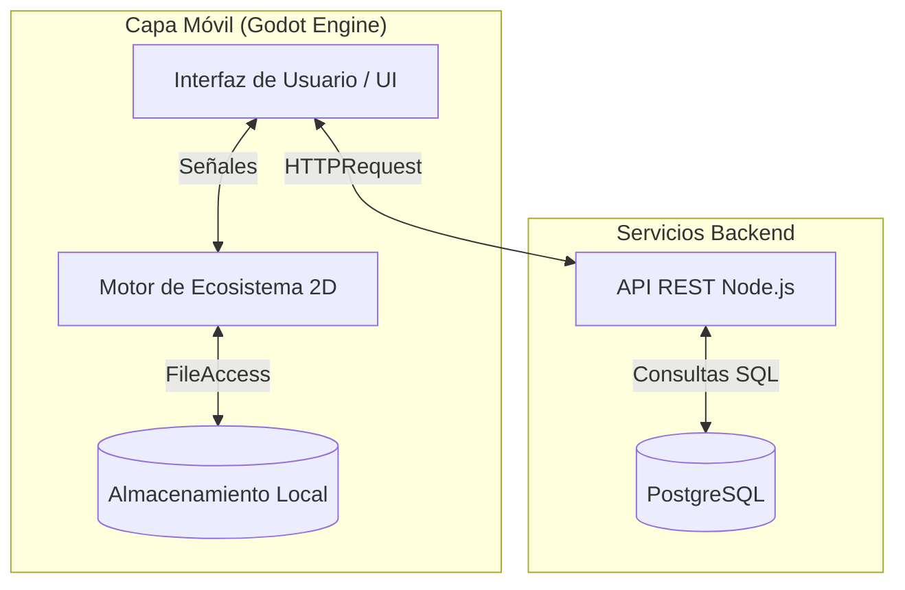
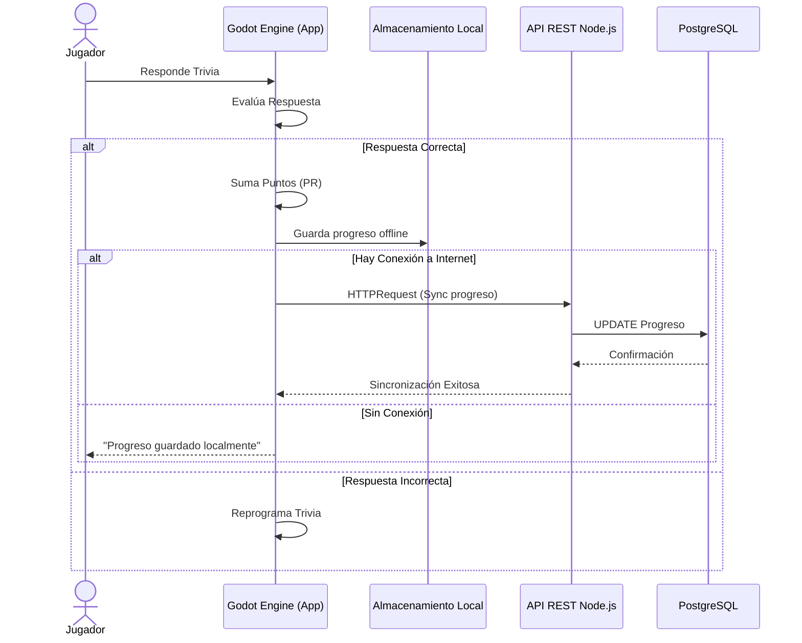
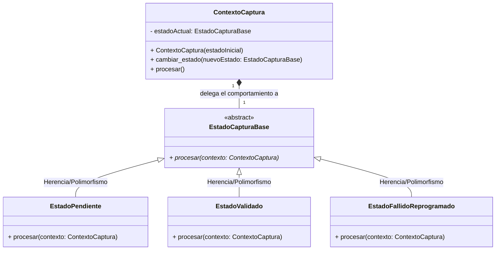
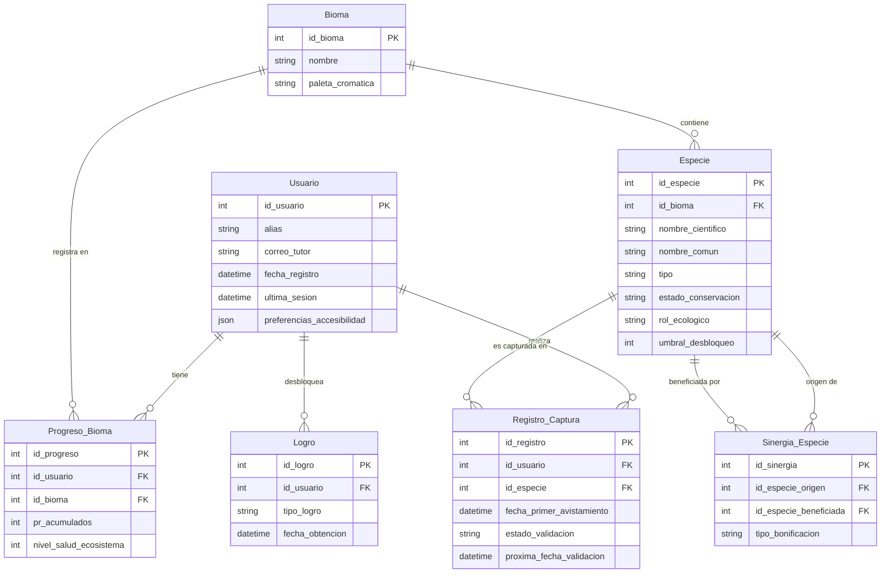

|

Faunetra

Germán Oses

Joshua Villavicencio

PROFESOR GUÍA:  Laura Griffiths 

PROFESOR CORREFERENTE: 

INFORME DE AVANCE

Ingeniería Informática

Abril 2026

**RESUMEN**

El presente informe de avance aborda la baja familiaridad de la población chilena con su biodiversidad nativa, problemática asociada a fenómenos como la ceguera hacia lo nativo y la extinción de la experiencia. A pesar de la alta diversidad biológica del país, existe una brecha significativa entre el conocimiento científico disponible y el conocimiento efectivo de la ciudadanía, lo que limita su valoración y protección.

Como respuesta, se propone el diseño de Faunetra, un videojuego educativo interactivo orientado a público general. La propuesta integra mecánicas de exploración, identificación de especies y resolución de trivias, organizadas en un ciclo de juego basado en el aprendizaje progresivo y la restauración de ecosistemas virtuales.

El informe presenta el marco teórico que sustenta la propuesta, el análisis del estado del arte, los objetivos del proyecto y una planificación de desarrollo orientada a la construcción de un prototipo funcional. Se espera que esta iniciativa contribuya a acercar el conocimiento sobre la biodiversidad chilena mediante una experiencia interactiva, accesible y con base científica.

**Palabras clave:** biodiversidad, videojuegos educativos, gamificación, aprendizaje basado en juegos, fauna nativa

**ABSTRAC**

*This progress report addresses the limited public awareness of Chile’s native biodiversity, a problem associated with phenomena such as native blindness and the extinction of experience. Despite the country’s rich biological diversity, a significant gap exists between available scientific knowledge and what people actually recognize, which limits environmental awareness and conservation efforts.*

*In response, this project proposes the design of Faunetra, an interactive educational video game aimed at a general audience. The system integrates gameplay mechanics such as exploration, species identification, and trivia challenges, structured within a loop designed to promote progressive learning and ecosystem restoration.*

*This report presents the theoretical framework, state-of-the-art analysis, project objectives, and a development plan focused on building a functional prototype. The initiative aims to support environmental education through an accessible, engaging, and scientifically grounded digital experience.*

**Keywords:** biodiversity, educational video games, gamification, game-based learning, native species.

	

**ÍNDICE GENERAL**

**[1\.  INTRODUCCIÓN	3](#1.-introducción)**

[**2\. DESCRIPCIÓN DEL PROBLEMA	4**](#2.-descripción-del-problema)

[2.1.  Ceguera hacia lo nativo y homogeneización biocultural	4](#2.1.-ceguera-hacia-lo-nativo-y-homogeneización-biocultural)

[2.2.  Extinción de la experiencia	4](#2.2.-extinción-de-la-experiencia)

[2.3. Relevancia del contexto chileno	5](#2.3.-relevancia-del-contexto-chileno)

[**3\.  OBJETIVO	6**](#3.-objetivo)

[3.1.  Objetivo General	6](#3.1.-objetivo-general)

[3.2.  Objetivos Específicos	6](#3.2.-objetivos-específicos)

[**4\.  MARCO TEÓRICO	7**](#4.-marco-teórico)

[4.1. Psicología de la Percepción: La Ceguera Botánica	7](#4.1.-psicología-de-la-percepción:-la-ceguera-botánica)

[4.2. Ética Biocultural y la Extinción de la Experiencia	7](#4.2.-ética-biocultural-y-la-extinción-de-la-experiencia)

[4.3. Aprendizaje Basado en Juegos	8](#4.3.-aprendizaje-basado-en-juegos)

[4.4.  Gamificación	8](#4.4.-gamificación)

[**5\. ESTADO DEL ARTE	9**](#5.-estado-del-arte)

[5.1 Plataformas de Ciencia Ciudadana	9](#5.1-plataformas-de-ciencia-ciudadana)

[5.2 Videojuegos orientados a biodiversidad y educación ambiental	10](#5.2-videojuegos-orientados-a-biodiversidad-y-educación-ambiental)

[5.3 Juegos con Biodiversidad Local	10](#5.3-juegos-con-biodiversidad-local)

[5.4 Propuestas Latinoamericanas	11](#5.4-propuestas-latinoamericanas)

[5.5 Análisis Comparativo	12](#5.5-análisis-comparativo)

[5.6 Brecha identificada	12](#5.6-brecha-identificada)

[**6\. PLAN DE TRABAJO	14**](#6.-plan-de-trabajo)

[6.1 Uso de herramientas de inteligencia artificial	15](#6.1-uso-de-herramientas-de-inteligencia-artificial)

[**7\. PROPUESTA	16**](#7.-propuesta)

[7.1 Descripción General del Sistema	16](#7.1-descripción-general-del-sistema)

[7.2 Mecánicas de Juego	16](#7.2-mecánicas-de-juego)

[7.2.1. Economía del Refugio y Progresión	18](#7.2.1.-economía-del-refugio-y-progresión)

[7.2.2. Algoritmo de Validación (Repetición Espaciada)	18](#7.2.2.-algoritmo-de-validación-\(repetición-espaciada\))

[7.2.3. Mecánicas de Obtención de Recursos (PR)	19](#7.2.3.-mecánicas-de-obtención-de-recursos-\(pr\))

[7.2.4. Dinámica de Degradación por Abandono	19](#7.2.4.-dinámica-de-degradación-por-abandono)

[7.3 Base de Datos de Especies	19](#7.3-base-de-datos-de-especies)

[7.4 Lineamientos de diseño de Interfaz	20](#7.4-lineamientos-de-diseño-de-interfaz)

[7.5 Especificacion de Requerimientos	20](#7.5-especificacion-de-requerimientos)

[7.5.1. Requerimientos Funcionales (RF)	20](#7.5.1.-requerimientos-funcionales-\(rf\))

[7.5.2. Requerimientos No Funcionales (RNF)	21](#7.5.2.-requerimientos-no-funcionales-\(rnf\))

[7.6. Arquitectura y Stack Tecnológico	22](#7.6.-arquitectura-y-stack-tecnológico)

[7.6.1. Frontend y capa nativa: React Native	24](#7.6.1.-frontend-y-capa-nativa:-react-native)

[7.6.2. Motor gráfico e interactividad: Phaser 3	24](#7.6.2.-motor-gráfico-e-interactividad:-phaser-3)

[7.6.3. Backend y lógica de servidor: Node.js	25](#7.6.3.-backend-y-lógica-de-servidor:-node.js)

[7.6.4. Persistencia de datos: PostgreSQL	25](#7.6.4.-persistencia-de-datos:-postgresql)

[7.7. Dirección de Arte y Estética Visual	26](#7.7.-dirección-de-arte-y-estética-visual)

[7.7.1. Estilo gráfico y perspectiva	26](#7.7.1.-estilo-gráfico-y-perspectiva)

[7.7.2. Animación y retroalimentación visual	26](#7.7.2.-animación-y-retroalimentación-visual)

[7.7.3. Diseño de interfaz de usuario (UI)	27](#7.7.3.-diseño-de-interfaz-de-usuario-\(ui\))

[7.7.4. Paletas cromáticas por bioma	27](#7.7.4.-paletas-cromáticas-por-bioma)

[7.8. Plan de Validación y Pruebas de Usabilidad	28](#7.8.-plan-de-validación-y-pruebas-de-usabilidad)

[7.8.1. Perfiles de usuario	28](#7.8.1.-perfiles-de-usuario)

[7.8.2. Metodología e instrumentos de evaluación	28](#7.8.2.-metodología-e-instrumentos-de-evaluación)

[7.8.3. Métricas de éxito	29](#7.8.3.-métricas-de-éxito)

[7.8.4. Evaluación de impacto educativo (Proyecto de Título)	30](#7.8.4.-evaluación-de-impacto-educativo-\(proyecto-de-título\))

[**8\. REFERENCIAS	31**](#heading=h.2cl3xyux2d2q)

[**9\. Anexos	34**](#10.-anexos)

[ANEXO A: Catálogo Maestro de Especies del Sistema (Faunetra)	34](#anexo-a:-catálogo-maestro-de-especies-del-sistema-\(faunetra\))

[A.1 Especies del Bioma Norte Árido	34](#a.1-especies-del-bioma-norte-árido)

[A.2 Especies del Bioma Zona Central Mediterránea	38](#a.2-especies-del-bioma-zona-central-mediterránea)

[A.3 Especies del Bioma Bosques Templados del Sur	41](#a.3-especies-del-bioma-bosques-templados-del-sur)

[A.4 Especies del Bioma Patagonia	45](#a.4-especies-del-bioma-patagonia)

[A.5 Especies del Bioma Territorios Insulares	49](#a.5-especies-del-bioma-territorios-insulares)

**LISTA DE TABLAS**                                                                   
[**Tabla 1:Analisis Comparativo del estado del arte**	10](#tabla-1:-análisis-comparativo-del-estado-del-arte)  
[Tabla 2: Plan De Trabajo	12](#tabla-2:-plan-de-trabajo)

# **1\.  INTRODUCCIÓN** {#1.-introducción}

Chile posee una de las diversidades biológicas más singulares del planeta. Su particular geografía —una larga y angosta franja de tierra encerrada entre la Cordillera de los Andes, el Océano Pacífico y el Desierto de Atacama— ha dado origen a una gran variedad de ecosistemas que albergan especies únicas en el mundo. Según el catálogo elaborado por Rodríguez et al. (2018), el país cuenta con más de 5.000 especies de plantas vasculares, de las cuales cerca del 52% son endémicas, es decir, no se encuentran en ningún otro lugar. De manera similar, el Inventario Nacional de Especies del Ministerio del Medio Ambiente (MMA, 2023\) registra cientos de vertebrados terrestres nativos, muchos de ellos en distintas categorías de amenaza.

A pesar de esta riqueza natural, existe una distancia considerable entre el conocimiento acumulado por la ciencia y el que posee la ciudadanía. Frente a esta realidad, los videojuegos con fines educativos se presentan como una alternativa con gran potencial para la divulgación y el aprendizaje. Gee (2003) plantea que los entornos digitales de juego favorecen el aprendizaje activo y la resolución de problemas, mientras que Mayer (2019) destaca su capacidad para ayudar a retener información compleja. Asimismo, Deterding et al. (2011) y Kapp (2012) han mostrado cómo el uso de elementos lúdicos en contextos no recreativos —la llamada gamificación— puede aumentar de manera importante la motivación y el compromiso de los usuarios.

Sobre esta base, el presente informe de avance establece las coordenadas iniciales para el diseño conceptual de Faunetra, un videojuego educativo interactivo cuyo propósito fundamental será facilitar el acercamiento a la biodiversidad chilena mediante una experiencia accesible y entretenida.

# **2\. DESCRIPCIÓN DEL PROBLEMA** {#2.-descripción-del-problema}

A continuación, se explica el problema que da origen a este proyecto. Se analizan dos situaciones que se refuerzan entre sí. Por un lado, la poca atención que se presta a las plantas y animales del entorno cotidiano. Por otro, la pérdida del contacto directo con la naturaleza. Esta combinación genera un alejamiento que dificulta valorar y proteger el medio ambiente local.

## ***2.1.  Ceguera hacia lo nativo y homogeneización biocultural*** {#2.1.-ceguera-hacia-lo-nativo-y-homogeneización-biocultural}

La gran diversidad biológica de Chile contrasta con el escaso conocimiento que la población general tiene sobre las especies que habitan el territorio. Se advierte una comprensión limitada sobre sus características, su rol en los ecosistemas y su estado de conservación. Esta situación no afecta solo a un grupo en particular, sino que cruza distintos sectores de la sociedad.

Este problema se relaciona con el concepto de "ceguera hacia lo nativo" (González & Inostroza, 2025\) o ceguera botánica, que describe la tendencia a pasar por alto los elementos naturales del entorno inmediato. Dicho fenómeno se ve reforzado por la influencia de medios de comunicación globalizados, que promueven una cultura visual centrada en especies exóticas o de gran presencia mediática.

Como resultado, se produce un proceso de homogeneización biocultural (Méndez et al., 2023), donde el conocimiento sobre flora y fauna local se diluye frente a un imaginario global. Es común que una persona reconozca sin dificultad a un león o un elefante, pero desconozca por completo a especies nativas como el huemul o el monito del monte. Investigaciones recientes indican que menos del 40% de la población chilena logra identificar correctamente especies nativas en peligro de extinción (Méndez et al., 2023).

## ***2.2.  Extinción de la experiencia*** {#2.2.-extinción-de-la-experiencia}

Aunque en los últimos años ha aumentado el interés por actividades al aire libre como el senderismo o el montañismo, este fenómeno sigue siendo limitado y está muy condicionado por factores socioeconómicos y de acceso.

Soga y Gaston (2016) definen la "extinción de la experiencia" como la pérdida progresiva del contacto directo con la naturaleza. Este proceso genera un círculo vicioso: a menor interacción con el entorno, menor es el interés por conocerlo y, en consecuencia, menor es también la voluntad de protegerlo.

En el caso chileno, Rozzi (2013) señala que esta desconexión afecta la identidad territorial, debilitando el vínculo entre las personas y su entorno natural. La consecuencia directa es una disminución tanto del conocimiento como de la valoración del patrimonio biocultural del país.

## ***2.3. Relevancia del contexto chileno*** {#2.3.-relevancia-del-contexto-chileno}

El diagnóstico anterior revela la necesidad de generar nuevas formas de reconectar a la ciudadanía con su patrimonio natural, superando las barreras que imponen la urbanización creciente y el estilo de vida mediado por pantallas. Resulta fundamental explorar estrategias que logren captar la atención de las personas y ofrecer experiencias significativas capaces de anclar el conocimiento en una vivencia lúdica y memorable.

# **3\.  OBJETIVO** {#3.-objetivo}

En este apartado se definen las metas del trabajo. Se distingue entre un objetivo general, que resume lo que se quiere lograr, y varios objetivos específicos, que detallan los pasos para alcanzarlo. Estas metas sirven como guía para el desarrollo del proyecto y permitirán comprobar más adelante si se cumplió lo propuesto.

## ***3.1.  Objetivo General*** {#3.1.-objetivo-general}

Diseñar y desarrollar un videojuego educativo interactivo sobre la flora y fauna nativa de Chile, accesible para público general, que permita al usuario explorar, reconocer y aprender sobre la biodiversidad del país de manera entretenida y con contenidos científicamente fundados.

## ***3.2.  Objetivos Específicos*** {#3.2.-objetivos-específicos}

* Definir y estructurar el contenido del videojuego en torno a los principales ecosistemas de Chile —norte árido, zona central mediterránea, bosques templados del sur, Patagonia y territorios insulares—, organizando la información para favorecer un aprendizaje progresivo.

* Construir una base de datos con al menos 80 especies nativas, que incluya información taxonómica, estado de conservación, material visual ilustrado y paisajes sonoros ambientales, empleando fuentes oficiales y literatura científica.

* Diseñar e implementar mecánicas de juego orientadas al aprendizaje, tales como exploración, trivia, clasificación y colección de especies, considerando niveles de dificultad progresivos y adaptables al perfil del usuario.

* Desarrollar una aplicación móvil multiplataforma (iOS y Android) utilizando frameworks de desarrollo nativo, asegurando que la experiencia lúdica y la interfaz de usuario estén optimizadas para dispositivos móviles y no requieren de conexión permanente a internet para sus funciones básicas.

* Evaluar la usabilidad y funcionalidad del prototipo mediante pruebas con al menos tres perfiles de usuario (estudiante de enseñanza media, adulto sin formación científica y profesional del área ambiental), atendiendo a criterios de facilidad de uso, claridad de la interfaz y cumplimiento de los objetivos de aprendizaje.

# **4\.  MARCO TEÓRICO** {#4.-marco-teórico}

Este capítulo reúne los conceptos principales que sostienen la propuesta. Se revisan cuatro temas clave. Primero, cómo funciona nuestra atención al observar la naturaleza. Segundo, por qué es importante el contacto con el entorno. Tercero, qué hace efectivos a los juegos para aprender. Cuarto, cómo los elementos lúdicos pueden aumentar el interés de las personas. Estas ideas ayudan a entender mejor la base de Faunetra.

## ***4.1. Psicología de la Percepción: La Ceguera Botánica*** {#4.1.-psicología-de-la-percepción:-la-ceguera-botánica}

El cerebro humano ha evolucionado para prestar atención prioritaria a estímulos que representan una amenaza o una recompensa inmediata —como el movimiento o el sonido—. Esta herencia evolutiva ha dado lugar a una atención selectiva que favorece la detección de animales por sobre las plantas. El concepto de *Plant Blindness* (Ceguera Botánica), propuesto por Wandersee y Schussler (1999), describe justamente esta dificultad para notar las plantas en el entorno, las cuales suelen ser percibidas como un simple fondo decorativo sin relevancia individual.

Para contrarrestar esta tendencia natural, el diseño conceptual de *Faunetra* contemplaría una estética que destaque la forma de las plantas y mecánicas que exijan una identificación activa. El objetivo de fondo sería ayudar al usuario a ver las especies vegetales como elementos singulares y significativos, sacándolas del fondo indiferenciado y ubicándolas en el centro de la experiencia lúdica.

## ***4.2. Ética Biocultural y la Extinción de la Experiencia*** {#4.2.-ética-biocultural-y-la-extinción-de-la-experiencia}

A pesar del aumento en el interés por actividades de excursionismo en Chile —reflejado en el crecimiento de visitas a Áreas Silvestres Protegidas (ASP) reportado por CONAF, con más de 3 millones de visitantes al año—, este fenómeno sigue siendo relativamente acotado y está segmentado por factores socioeconómicos. Para una parte importante de la juventud urbana, la expansión de las ciudades y el estilo de vida digital han profundizado lo que Soga y Gaston (2016) denominan "Extinción de la Experiencia".

Este proceso describe un ciclo donde la falta de contacto directo con la naturaleza reduce el interés por conocerla, lo que a su vez debilita la voluntad de protegerla. En el contexto nacional, Ricardo Rozzi (2013) indica que esta desconexión afecta la identidad territorial, pues los jóvenes pierden el vínculo con las especies nativas y con los beneficios que los ecosistemas brindan, al no reconocerlas como parte de su propio entorno.

## 

## ***4.3. Aprendizaje Basado en Juegos*** {#4.3.-aprendizaje-basado-en-juegos}

Los videojuegos educativos se apoyan en teorías de aprendizaje situado y cognitivo. Gee (2003) identificó numerosos principios de aprendizaje presentes en los buenos videojuegos, entre ellos el aprendizaje activo, la resolución de problemas en contextos complejos y la retroalimentación inmediata. Plass et al. (2015) demostraron que los juegos educativos bien diseñados mejoran la retención de información y la capacidad de aplicar lo aprendido a situaciones reales.

## ***4.4.  Gamificación*** {#4.4.-gamificación}

La gamificación, según Deterding et al. (2011), consiste en el uso de elementos propios del diseño de juegos en contextos que no son lúdicos. Kapp (2012) argumenta que una gamificación efectiva requiere no solo mecánicas visibles (puntos, medallas), sino también dinámicas que generen una progresión interesante y una estética que conecte emocionalmente con el usuario.

# **5\. ESTADO DEL ARTE** {#5.-estado-del-arte}

En la última década,se ha observado un crecimiento en el desarrollo de aplicaciones y videojuegos orientados al aprendizaje de biodiversidad, los cuales integran tecnologías como inteligencia artificial, simulación ecológica y bases de datos científicas. Estas soluciones integran tecnologías como inteligencia artificial, visión computacional y procesamiento de audio, con el objetivo de facilitar la identificación de especies y promover la educación ambiental. No obstante, presentan diversas limitaciones técnicas y de diseño que condicionan su aplicabilidad en contextos educativos amplios. 

## ***5.1 Plataformas de Ciencia Ciudadana*** {#5.1-plataformas-de-ciencia-ciudadana}

Uno de los mayores referentes es la plataforma iNaturalist, orientada a la observación y registro de biodiversidad mediante la participación de usuarios.

El funcionamiento de este sistema se basa en la captura de imágenes georreferenciadas, las cuales son procesadas mediante modelos de visión computacional entrenados con grandes volúmenes de datos. Posteriormente, las observaciones pueden ser validadas por la comunidad, lo que permite mejorar la precisión a través de inteligencia colectiva. Este enfoque ha demostrado ser efectivo en la generación de datos científicos a gran escala (Van Horn et al., 2018).

Desde el punto de vista tecnológico, iNaturalist utiliza redes neuronales convolucionales (CNN) para la clasificación de imágenes, junto con arquitecturas en la nube para el procesamiento y almacenamiento de datos. Además, se integra con repositorios científicos como GBIF, lo que fortalece su valor investigativo.

No obstante, presenta limitaciones relevantes. En primer lugar, la precisión del sistema depende de la calidad de las imágenes y de las condiciones del entorno. A su vez, el uso de modelos de aprendizaje profundo implica un alto costo computacional, especialmente cuando el procesamiento se realiza en servidores remotos y por último su enfoque está orientado principalmente a usuarios con cierto nivel de conocimiento, lo que reduce su accesibilidad para públicos generales.

Una alternativa más accesible es Seek by iNaturalist, diseñada para facilitar la identificación en tiempo real.  
Esta aplicación permite reconocer especies directamente mediante la cámara del dispositivo, utilizando modelos de aprendizaje automático optimizados para ejecución local. Este enfoque reduce la latencia y mejora la experiencia de usuario, al no requerir procesamiento remoto constante.

Sin embargo, la simplificación de los modelos para su ejecución en dispositivos móviles implica una disminución en la precisión. Además, el rendimiento del sistema depende de las capacidades del hardware, lo que introduce limitaciones en dispositivos de gama media o baja.  
En el ámbito especializado de la identificación de aves, destaca Merlin Bird ID, desarrollada por el Cornell Lab of Ornithology.  
La cual permite la identificación de especies tanto a partir de imágenes como de registros de audio. En particular, el reconocimiento de cantos de aves se basa en el análisis de patrones acústicos mediante modelos de aprendizaje profundo entrenados con bases de datos como eBird (Kahl et al., 2021). Este enfoque amplía las capacidades de identificación, permitiendo el reconocimiento en situaciones donde la observación visual no es posible.

ademas, el procesamiento de señales de audio en tiempo real implica un alto costo computacional. Adicionalmente, factores como el ruido ambiental o la baja calidad de grabación pueden afectar la precisión del sistema. Finalmente, su enfoque especializado limita su aplicabilidad a un conjunto específico de especies. 

## ***5.2 Videojuegos orientados a biodiversidad y educación ambiental*** {#5.2-videojuegos-orientados-a-biodiversidad-y-educación-ambiental}

Un ejemplo relevante es Alba: A Wildlife Adventure, el cual se centra en la exploración y registro de especies dentro de un entorno virtual.

En este sistema, el usuario recorre un entorno natural e identifica especies mediante el uso de una cámara virtual, registrándolas en una base de datos interna. Este enfoque promueve la observación del entorno y la sensibilización ambiental mediante mecánicas de exploración y colección.

Desde el punto de vista tecnológico, se utilizan motores gráficos como Unity, junto con estructuras de almacenamiento internas para la gestión de información. Sin embargo, las especies se encuentran predefinidas y no existe interacción con el entorno real del usuario, lo que limita la experiencia a un entorno simulado sin conexión con datos reales.  
Otro referente es Terra Nil, el cual propone la restauración de ecosistemas mediante la gestión de variables ambientales.

El sistema se basa en modelos simplificados de simulación ecológica, permitiendo la intervención sobre factores como temperatura, humedad y contaminación. Si bien este enfoque introduce conceptos relevantes de sostenibilidad, no incorpora especies reales identificables ni interacción con el entorno físico del usuario. Asimismo, su funcionamiento se restringe a un entorno cerrado, lo que limita su potencial como herramienta de aprendizaje contextual.  
 

## ***5.3 Juegos con Biodiversidad Local*** {#5.3-juegos-con-biodiversidad-local}

En el contexto chileno, existen iniciativas que abordan la biodiversidad desde una perspectiva lúdica, principalmente en formatos no digitales. Un ejemplo relevante es el juego de mesa Kurrüf, desarrollado en conjunto con la Reserva Biológica Huilo Huilo.

Este juego se basa en la exploración de ecosistemas reales, donde los participantes interactúan con especies nativas representadas mediante cartas, estableciendo relaciones ecológicas como cadenas tróficas. Este tipo de propuestas evidencia el interés por integrar biodiversidad local en experiencias educativas.  
Sin embargo, al tratarse de un formato físico, presenta limitaciones en términos de escalabilidad, actualización de contenido y alcance tecnológico. De manera similar, otros juegos como Ilan (biodiversidad antártica) y Toskasi (bioma marino) refuerzan esta tendencia, aunque mantienen restricciones propias de los formatos no digitales. 

## ***5.4 Propuestas Latinoamericanas*** {#5.4-propuestas-latinoamericanas}

En el contexto latinoamericano, se han desarrollado diversas iniciativas académicas orientadas a la educación ambiental mediante videojuegos y recursos interactivos.

En Ecuador, Macías (2018) desarrolló un videojuego en 3D en el cual un personaje recorre el ecosistema del páramo interactuando con especies y contenidos culturales. En Venezuela, Lima et al. (2015) propusieron un videojuego educativo centrado en especies en peligro de extinción distribuidas en distintos escenarios.

En Argentina, el portal educ.ar desarrolló un recurso interactivo enfocado en el rescate de fauna afectada por el tráfico ilegal. Por su parte, en Colombia, Salas (2017) documentó el uso de juegos didácticos para la enseñanza de cadenas alimenticias, evidenciando mejoras en el aprendizaje de los estudiantes.

En conjunto, estas propuestas reflejan una tendencia regional hacia el uso de herramientas lúdicas como medio de educación ambiental. En este sentido, Balmford et al. (2002) plantean que las personas tienden a valorar aquello que conocen, lo que refuerza la importancia de generar experiencias que acerquen la biodiversidad al usuario. 

## ***5.5 Análisis Comparativo*** {#5.5-análisis-comparativo}

A continuación, se presenta una síntesis comparativa de las principales soluciones analizadas:

***Tabla 1:*** ***Análisis comparativo del estado del arte***

| Herramienta | Tipo | Fauna Local | Público | Gamificación |
| :---- | :---- | :---- | :---- | :---- |
| iNaturalist | Plataforma científica | Sí (global) | Adultos / Expertos | Baja |
| Seek by iNaturalist | App educativa | Sí (global) | General / Niños | Media |
|  Merlin Bird ID  | App identificación |  Parcial (aves)  | General |  Media  |
| Terra Nil | Videojuego | No (genérico) | General | Alta |
| Kurrüf / Ilan / Toskasi | Juego de mesa | Sí (Chile) | Familiar | Media |
| Picture Bird | App identificación | Sí (global) | Adultos | Baja |
| Faunetra (propuesto) | Videojuego | Sí (Chile) | Niños 7+ / Familias | Alta |

## ***5.6 Brecha identificada*** {#5.6-brecha-identificada}

El análisis comparativo permite identificar con mayor precisión la brecha que Faunetra busca cubrir. Las soluciones de ciencia ciudadana como iNaturalist y Merlin Bird ID ofrecen contenido científico validado y alcance global, pero presentan baja gamificación, escasa retroalimentación educativa y nula adaptación al contexto chileno. Por su parte, videojuegos como Terra Nil logran una experiencia lúdica de alta calidad, pero prescinden de biodiversidad real e identificable y no incorporan mecánicas de aprendizaje explícitas.

Los juegos de mesa chilenos como Kurrüf, Ilan y Toskasi sí abordan la fauna local con pertinencia territorial, pero su formato físico limita su escalabilidad, la actualización de contenidos y el acceso tecnológico para una audiencia amplia.

Se observa así una ausencia transversal de soluciones que integren simultáneamente: biodiversidad nativa chilena con respaldo científico, mecánicas de aprendizaje progresivo con retroalimentación activa, alta gamificación orientada a niños y familias, y funcionamiento sin dependencia permanente de conexión a internet. Esta combinación de atributos constituye la propuesta de valor diferencial de Faunetra.

# **6\. PLAN DE TRABAJO** {#6.-plan-de-trabajo}

El desarrollo del proyecto se organizará en cinco etapas a lo largo de 12 semanas. Se adoptará una metodología iterativa basada en principios ágiles, con revisiones al cierre de cada fase. Las tecnologías consideradas son Godot Engine para el desarrollo principal del videojuego e interactividad, SQLite/PostgreSQL para la base de datos (la cual se encuentra parcialmente implementada y en fase de corrección), Figma para el prototipado visual, y Git con flujo GitFlow para el control de versiones.  
*Tabla 2: Plan De Trabajo*

| Fase | Período | Etapa | Actividades principales | Entregables |
| ----- | ----- | ----- | ----- | ----- |
| Fase 1 | Semanas 1-2 | Investigación y Diseño Conceptual | Relevamiento de 80 especies nativas (fuentes MMA/GBIF), análisis del problema (Ceguera Botánica) y definición de objetivos. | Documento de análisis del problema y definición de objetivos iniciales. |
| Fase 2 | Semanas 3-5 | Especificación de Requerimientos y Arquitectura | Definición de requerimientos funcionales y no funcionales; diseño del Modelo Entidad-Relación (MER) y esquema de la base de datos. | Informe de Avance (17 de abril); Diccionario de datos y diagramas de arquitectura. |
| Fase 3 | Semanas 6-8 | Diseño de Interfaz (UX/UI) y Prototipado | Diseño de wireframes y prototipos de alta fidelidad en Figma; definición del flujo de usuario y navegación del juego. | presentación de Avance (21 de abril); Mockups interactivos de la interfaz de Faunetra. |
| Fase 4 | Semanas 9-10 | Planificación de Pruebas y Validación | Diseño del plan de pruebas de usabilidad y definición de métricas para medir el impacto educativo y la retención de conocimiento. | Documento de plan de pruebas y validación del diseño con usuarios. |
| Fase 5 | Semanas 11-12 | Refinamiento y Documentación Final | Ajustes finales a los prototipos basados en la validación teórica; redacción del informe final del proyecto. | Informe Final del Proyecto (19 de junio); Dossier de diseño técnico completo. |

*El siguiente diagrama muestra la distribución temporal de las fases del proyecto* 

## 

## 

## 

## ***6.1 Uso de herramientas de inteligencia artificial*** {#6.1-uso-de-herramientas-de-inteligencia-artificial}

Durante el desarrollo del presente informe se utilizaron herramientas de inteligencia artificial, específicamente Gemini 3.1 Pro de Google, como apoyo en la redacción, organización de ideas y mejora de la coherencia textual

Su uso se limitó a funciones de asistencia, no siendo empleada como fuente primaria de información. En este sentido, todos los contenidos fueron revisados, contrastados y complementados mediante fuentes académicas y literatura científica confiable, resguardando la validez y rigurosidad del documento.

# **7\. PROPUESTA** {#7.-propuesta}

En esta sección se presenta una descripción inicial del sistema *Faunetra*. Por tratarse de una etapa temprana del proyecto, todos los elementos aquí descritos deben entenderse como parte de una propuesta en construcción, sujeta a ajustes y refinamientos durante el proceso de desarrollo.

## ***7.1 Descripción General del Sistema*** {#7.1-descripción-general-del-sistema}

*Faunetra* se concibe como un juego de ecosistema lúdico híbrido, inspirado en el estilo de los *cozy games* (juegos relajantes) y en la simulación de gestión de santuarios naturales. El propósito central del sistema sería contribuir a mitigar la "ceguera botánica" y la "extinción de la experiencia" en relación con el patrimonio natural chileno.

A diferencia de otros juegos de colección que se basan en la captura o la competencia, *Faunetra* propondría una mecánica principal de "Observar para restaurar". El sistema se estructuraría en torno a un Refugio Digital, accesible desde cualquier lugar con conexión a internet. En este espacio, el usuario administraría un terreno inicialmente deteriorado que representaría un bioma chileno (por ejemplo, Bosque Esclerófilo o Estepa Patagónica). El avance en la restauración del ecosistema virtual dependería de la resolución de trivias y desafíos de conocimiento, los cuales generarían Puntos de Restauración (PR) .  
 

## ***7.2 Mecánicas de Juego*** {#7.2-mecánicas-de-juego}

Las mecánicas están diseñadas para favorecer una progresión tranquila y satisfactoria, donde se privilegie el aprendizaje por sobre la destreza manual o la velocidad. El sistema se articula en torno a un ciclo de juego principal (Core Loop) de tres etapas: **Aprender, Sanar y Atraer**.

*   **Aprender:** El usuario consulta la "Biopedia" (enciclopedia interna) y resuelve sesiones cortas de trivias para obtener Puntos de Restauración (PR).
*   **Sanar:** Los PR acumulados se invierten directamente en el mapa en acciones sobre el terreno digital, como eliminar elementos degradantes (microbasurales virtuales) o plantar especies nativas ya descubiertas.
*   **Atraer:** Cuando el ecosistema virtual alcanza ciertos niveles de salud y diversidad vegetal, la fauna nativa asociada comienza a aparecer de manera pasiva en el refugio, completando la colección del usuario sin necesidad de captura activa.

### **7.2.1. Estructura de Progresión y Economía del Refugio** {#7.2.1.-economía-del-refugio-y-progresión}

**Progresión por Biomas Ecosistémicos:** El juego reemplaza los niveles numéricos tradicionales por una estructura basada en **Biomas Ecosistémicos Desbloqueables** (Norte Árido, Zona Central Mediterránea, Bosques Templados del Sur, Patagonia y Territorios Insulares). Cada bioma cuenta con un **Indicador de Salud de Ecosistema (0% a 100%)**. El usuario debe incrementar la salud del bioma actual hasta un umbral crítico (ej. 75%) para desbloquear el acceso al siguiente ecosistema.

**Economía localizada:** Los Puntos de Restauración (PR) están asociados estrictamente a su bioma de origen. La economía no es global; el progreso y los PR obtenidos en el "Norte Árido" no se transfieren al bioma de la "Zona Central". Esto refuerza la identidad ecológica de cada bioma y obliga al usuario a conocer sus características específicas.

**Flujo de gasto:** Los PR acumulados se utilizan como divisa para dos propósitos principales: 
1. La remoción de bloqueadores ambientales (limpieza de microbasurales virtuales o focos de especies invasoras).
2. La adquisición de insumos de optimización del terreno y semillas de especies vegetales nativas ya desbloqueadas.

**Descubrimiento en la Biopedia:** Las especies no descubiertas se presentan en la Biopedia de forma restringida, mostrando únicamente siluetas y datos taxonómicos básicos. El desbloqueo de la ficha técnica completa ocurre de forma orgánica al atraer al espécimen al refugio, o bien mediante la resolución de pistas conceptuales integradas en la interfaz.

### **7.2.2. Sistema de Trivias y Algoritmo de Repetición Espaciada** {#7.2.2.-algoritmo-de-validación-(repetición-espaciada)}

**Formato de Trivias por Rondas:** Las trivias no ocurren de forma aislada, sino en **rondas dinámicas de 3 a 5 preguntas cortas** (de selección múltiple o verdadero/falso) generadas dinámicamente a partir del contenido pedagógico almacenado en la Biopedia.

**Algoritmo de Validación (Repetición Espaciada):** Con el fin de favorecer la consolidación del conocimiento en la memoria a largo plazo, para validar de forma permanente una especie el sistema programa trivias de repaso en intervalos de tiempo progresivos: 24 horas, 3 días y 7 días posteriores al primer avistamiento.

**Tolerancia a errores y ausencia de castigo:** La respuesta incorrecta en un desafío de validación **no penaliza** la salud ni descuenta PR acumulados. El sistema simplemente congela la fase de validación actual y reprograma el reintento para la siguiente sesión del usuario, proporcionando además una pista interactiva de apoyo cognitivo para reducir la frustración.

**Sinergias pasivas e inter-especies:** La validación exitosa de una especie activa sus beneficios pasivos en el mapa. Se implementan reglas de coexistencia basadas en relaciones ecológicas reales; por ejemplo, ciertas especies vegetales como el Peumo otorgan bonificaciones de crecimiento y salud a especies colindantes como el Quillay.

### **7.2.3. Sistema de Interacción en Pantalla y Puzzles de Percepción** {#7.2.3.-mecánicas-de-obtención-de-recursos-(pr)}

**Interacción Isométrica 2D con Agregados Lúdicos:** La pantalla principal del refugio presenta el terreno en perspectiva isométrica 2D. El jugador interactúa directamente tocando las parcelas para limpiar o plantar. Para evitar la monotonía, esta interacción se complementa con **minijuegos y puzzles de percepción**:

*   **Puzzles de percepción visual:** Dinámicas orientadas a mitigar la "ceguera botánica", donde el usuario debe identificar especies camufladas en el paisaje, ejercitando la separación entre la flora y el fondo indiferenciado.
*   **Puzzles de asociación acústica:** Módulos donde el jugador escucha paisajes sonoros reales (cantos de aves, sonidos de anfibios) y debe asociarlos con su respectiva ficha visual en la Biopedia.
*   **Mitigación de amenazas ambientales:** Parches de degradación (microbasurales virtuales o focos de exóticas invasoras) que actúan como bloqueadores del terreno que consumen PR para ser removidos.

### **7.2.4. Dinámica de Degradación por Abandono** {#7.2.4.-dinámica-de-degradación-por-abandono}

El sistema calcula el tiempo de inactividad del usuario en tiempo real. Ante ausencias de varios días consecutivos, el ecosistema digital experimenta un deterioro progresivo: las plantas comienzan a marchitarse y la fauna nativa abandona temporalmente el refugio, reduciendo la salud del bioma y exigiendo una reinversión de PR para restaurar el hábitat al regresar. Esta mecánica busca incentivar el compromiso continuo del jugador sin llegar a eliminar su progreso alcanzado.

## ***7.3 Base de Datos de Especies*** {#7.3-base-de-datos-de-especies}

El catálogo inicial contemplaría al menos 80 especies nativas, organizadas según los grandes biomas del país: Norte Árido, Zona Central Mediterránea, Bosques Templados del Sur, Patagonia y Territorios Insulares. Cada ficha incluiría información taxonómica validada, estado de conservación, una breve descripción de su rol ecológico e ilustraciones de buena calidad. Para asegurar la seriedad del contenido, se recurriría a fuentes oficiales y literatura especializada. El detalle preliminar de especies consideradas para el prototipo se presenta en el [**Anexo A**.](#anexo-a:-catálogo-maestro-de-especies-del-sistema-\(faunetra\)) 

## ***7.4 Lineamientos de diseño de Interfaz*** {#7.4-lineamientos-de-diseño-de-interfaz}

En esta fase preliminar, el diseño de interfaz se guiaría por criterios de usabilidad universal y una estética visual orgánica. Se buscaría reducir la carga cognitiva y propiciar una inmersión serena. Los principios orientadores serían:

* Minimalismo Intencional: Interfaz limpia, sin exceso de elementos visuales, con jerarquías claras que faciliten la navegación.

* Accesibilidad Adaptativa: Uso de fuentes legibles y contrastes adecuados según estándares WCAG, para que la plataforma pueda ser usada por personas de distintas edades y condiciones visuales.

* Personalización Contextual: El sistema tendería a mostrar primero los biomas o especies con los que el usuario interactúa con mayor frecuencia.

	  
	

## ***7.5 Especificacion de Requerimientos*** {#7.5-especificacion-de-requerimientos}

### **7.5.1. Requerimientos Funcionales (RF)** {#7.5.1.-requerimientos-funcionales-(rf)}

**RF01 – Gestión de economía localizada:** El sistema debe calcular, almacenar y descontar los Puntos de Restauración (PR) de manera independiente para cada uno de los biomas disponibles.

**RF02 – Sistema de bloqueadores ambientales:** El sistema debe generar áreas bloqueadas en el terreno virtual y permitir su remoción únicamente mediante el cobro de la cantidad de PR especificada en la base de datos.

**RF03 – Catálogo restringido (Biopedia):** El sistema debe ocultar la información técnica y ecológica de las especies hasta que el usuario cumpla con las condiciones lúdicas de desbloqueo, mostrando únicamente siluetas y datos taxonómicos básicos en estado bloqueado.

**RF04 – Motor de trivias:** El sistema debe extraer datos dinámicamente de la Biopedia para generar preguntas evaluativas de selección múltiple o verdadero/falso, asignando PR al usuario tras cada respuesta correcta.

**RF05 – Algoritmo de repetición espaciada:** El sistema debe registrar el timestamp del primer avistamiento de una especie y programar eventos de validación a las 24 horas, 3 días y 7 días posteriores.

**RF06 – Manejo de fallos en validación:** Ante una respuesta incorrecta, el sistema debe reprogramar el desafío para la siguiente sesión y desplegar una pista de ayuda, sin alterar los puntos de salud de la especie afectada en el refugio.

**RF07 – Activación de sinergias:** El sistema debe calcular la adyacencia espacial de elementos vegetales en el mapa y aplicar multiplicadores de crecimiento si se cumplen las reglas de coexistencia definidas en la base de datos.

**RF08 – Puzzles de percepción:** El sistema debe instanciar módulos interactivos de identificación visual (siluetas camufladas) y asociación acústica (sonidos ambientales) como mecanismos complementarios de generación de PR.

**RF09 – Cálculo de degradación por abandono:** El sistema debe comparar la fecha del último inicio de sesión con la fecha actual. Si el tiempo de inactividad excede el umbral definido, debe reducir la salud del ecosistema digital y ocultar progresivamente la fauna atraída.

### **7.5.2. Requerimientos No Funcionales (RNF)** {#7.5.2.-requerimientos-no-funcionales-(rnf)}

**RNF01 – Stack tecnológico (móvil):** La aplicación móvil debe ser desarrollada íntegramente utilizando Godot Engine, aprovechando su arquitectura basada en nodos tanto para la interfaz de usuario (UI) como para la renderización del ecosistema lúdico.

**RNF02 – Stack tecnológico back-end:** La lógica de negocio central y la persistencia global de datos deben ser gestionadas mediante una API REST en Node.js conectada a una base de datos relacional PostgreSQL.

**RNF03 – Arquitectura multiplataforma:** El código fuente en GDScript debe exportarse para ser ejecutable tanto en Android (APK/AAB) como en iOS (IPA), adaptándose de forma responsiva a las resoluciones de pantalla móviles gracias a las herramientas nativas de anclaje de Godot.

**RNF04 – Conectividad y sincronización:** La aplicación debe manejar estados de desconexión a internet, almacenando temporalmente el progreso (PR y validaciones) en el almacenamiento local del dispositivo mediante el sistema de guardado de archivos de Godot y sincronizándolo con el servidor al recuperar la conexión.

**RNF05 – Rendimiento gráfico:** El tiempo de carga inicial de los biomas y la renderización de sprites 2D en Godot Engine no debe generar caídas de rendimiento (stuttering) en dispositivos móviles de gama media, manteniendo una tasa estable de 60 FPS.

**RNF06 – Accesibilidad visual:** La interfaz de usuario construida con los nodos Control de Godot debe cumplir con las pautas de accesibilidad WCAG, asegurando niveles de contraste adecuados para su uso en exteriores con luz solar directa

### **7.5.3. Restricciones del Sistema**

El desarrollo de Faunetra está condicionado por un conjunto de restricciones técnicas, temporales y normativas que delimitan el alcance del prototipo funcional y orientan las decisiones de diseño. Estas restricciones se documentan a continuación bajo la nomenclatura RT (Restricción Técnica), RA (Restricción de Alcance) y RL (Restricción Legal/Ética), en coherencia con la especificación de RF y RNF presentada previamente.  
RT01 – Compatibilidad de dispositivos: El sistema debe garantizar un funcionamiento estable en una ventana de compatibilidad limitada a dispositivos móviles modernos que soporten el renderizador utilizado por Godot Engine (ej. Vulkan o soporte OpenGL ES 3.0/2.0 según la versión de Godot empleada). Esta restricción excluye del alcance del prototipo a un segmento de dispositivos de gama baja con sistemas operativos muy desactualizados, lo que deberá ser considerado en la etapa de pruebas de usabilidad con el Perfil B (público general sin formación técnica).  
RT02 – Conectividad offline parcial: Si bien el RNF04 establece que el sistema debe operar sin conexión permanente a internet, esta funcionalidad offline está restringida a las acciones de progreso local (acumulación de PR, interacción con el terreno digital y resolución de trivias ya descargadas). Las operaciones que requieren validación contra el servidor central —como la sincronización del algoritmo de repetición espaciada, la descarga de nuevo contenido de la Biopedia o la actualización de las matrices de sinergia ecológica— quedan supeditadas a la disponibilidad de conexión a internet, no siendo posible su ejecución en modo completamente desconectado.  
RA01 – Restricción de alcance por cronograma: Considerando que el desarrollo se enmarca en un cronograma de 12 semanas (sección 6, Plan de Trabajo), el alcance del presente proyecto se circunscribe a la entrega de un prototipo de alta fidelidad —mockups interactivos y documentación técnica— sin incluir la implementación completa del backend en producción, la totalidad de las 80 fichas de especies con material audiovisual definitivo, ni la ejecución de las pruebas de evaluación de impacto educativo (pre-test/post-test), las cuales quedan explícitamente proyectadas para la etapa de Proyecto de Título (sección 7.8.4).  
RL01 – Privacidad de datos y protección de menores: Dado que el público objetivo principal del sistema corresponde a niños y jóvenes en edad escolar (Perfil A, entre 7 y 17 años), el sistema debe ajustarse a los principios de minimización de datos y privacidad por diseño. No se solicitará información personal identificable más allá de un alias de usuario y, en su defecto, datos de contacto de un tutor responsable para la creación de la cuenta. Asimismo, dado que el catálogo de especies incluye registros de fauna y flora en categorías de conservación crítica (CR, EN), la geolocalización exacta de avistamientos reales —en caso de integrarse en etapas futuras con plataformas de ciencia ciudadana como iNaturalist o GBIF— deberá ser objeto de ofuscación o generalización geográfica, con el fin de prevenir la exposición de coordenadas sensibles que puedan facilitar la caza furtiva o el tráfico ilegal de especies amenazadas.

.

## ***7.6. Arquitectura y Stack Tecnológico*** {#7.6.-arquitectura-y-stack-tecnológico}

Para el desarrollo de Faunetra se ha estructurado una arquitectura modular orientada a dispositivos móviles utilizando **Godot Engine** como núcleo principal tanto para la interfaz como para la interactividad. Esta decisión arquitectónica unifica el ecosistema de desarrollo y facilita la exportación a múltiples plataformas.

### **7.6.1. Motor gráfico y Frontend: Godot Engine** {#7.6.1.-motor-grafico-y-frontend:-godot-engine}

Se utilizará **Godot Engine** como el motor principal para la construcción de la aplicación móvil. Más allá de su destacada facilidad de uso y curva de aprendizaje amigable, la elección de Godot como motor de desarrollo se fundamenta en sus características técnicas y arquitectónicas:

**Justificación técnica:**
*   **Arquitectura basada en Nodos:** Permite un diseño altamente modular y orientado a la composición. Esto facilita la creación de interfaces complejas y entidades de juego que pueden encapsular su propia lógica de manera independiente, ideal para mantener el código ordenado.
*   **Licencia Open Source (MIT):** Garantiza que el proyecto no esté sujeto a regalías o costos de licencias en el futuro, otorgando total libertad sobre el código fuente.
*   **GDScript y Orientación a Objetos:** Su lenguaje nativo está diseñado específicamente para el desarrollo de juegos y se integra a la perfección con el paradigma de Programación Orientada a Objetos, permitiendo aplicar patrones de diseño complejos (como Máquinas de Estados) de forma nativa.
*   **Ligereza y Soporte Multiplataforma:** El motor es sumamente liviano y está optimizado para funcionar en una amplia gama de hardware, facilitando la exportación nativa a iOS y Android.

### **7.6.3. Backend y lógica de servidor: Node.js** {#7.6.3.-backend-y-lógica-de-servidor:-node.js}

El servidor central se construirá sobre Node.js, utilizando un entorno de ejecución asincrónico y no bloqueante orientado a eventos.

**Justificación técnica:** Node.js es idóneo para manejar el tráfico de sincronización de progreso de múltiples usuarios concurrentes. El servidor expondrá una API RESTful encargada de procesar las peticiones del cliente móvil, validar la lógica de negocio (como el algoritmo de repetición espaciada) y empaquetar la información en formato JSON para su consumo en la aplicación.

### **7.6.4. Persistencia de datos: PostgreSQL** {#7.6.4.-persistencia-de-datos:-postgresql}

El almacenamiento persistente y la estructura del conocimiento del sistema se administrarán mediante el motor de base de datos relacional PostgreSQL.

**Justificación técnica:** La elección de un modelo relacional es imperativa para garantizar la integridad de los datos científicos y las mecánicas de juego. PostgreSQL administrará entidades altamente estructuradas y relacionadas entre sí: el catálogo de biomas, las fichas taxonómicas de las 80 especies nativas, las matrices de reglas de coexistencia ecológica y los historiales de progreso y validación de cada usuario registrado.

## ***7.7. Dirección de Arte y Estética Visual*** {#7.7.-dirección-de-arte-y-estética-visual}

Para lograr el propósito inmersivo y relajante propio del modelo cozy game, la estética de Faunetra toma inspiración en los juegos de gestión idle modernos. Se aleja del hiperrealismo científico para adoptar una dirección artística basada en la abstracción amigable, la perspectiva isométrica y una alta legibilidad visual.

### **7.7.1. Estilo gráfico y perspectiva** {#7.7.1.-estilo-gráfico-y-perspectiva}

**Perspectiva isométrica 2D:** El refugio digital se construirá sobre una cuadrícula isométrica (vista en 3/4 desde arriba), lo que permite al usuario tener una visión global y ordenada del terreno que está restaurando, facilitando la gestión espacial de las plantas y la observación de la fauna.

**Arte vectorial estilizado:** Los elementos del ecosistema tendrán un diseño estilizado con proporciones amigables y redondeadas, utilizando colores planos y vibrantes con contornos limpios integrados en el color base, sin líneas negras duras.

**Proporciones amigables:** La fauna nativa (como el pudú o el zorro culpeo) tendrá un diseño ligeramente redondeado que transmita ternura y empatía, facilitando la conexión emocional del jugador con las especies representadas.

### **7.7.2. Animación y retroalimentación visual** {#7.7.2.-animación-y-retroalimentación-visual}

**Animación bouncy:** Las interacciones del usuario (plantar una especie, limpiar un área) tendrán respuestas visuales satisfactorias mediante animaciones de rebote suave (squash and stretch).

**Microinteracciones lúdicas:** Al generar PR o validar una especie, se desplegarán iconos flotantes animados y destellos sutiles que generan una sensación de recompensa inmediata, característica de los juegos idle.

**Animación idle pasiva:** El ecosistema se sentirá vivo con movimientos cíclicos sutiles: balanceo de follaje, movimiento de colas de animales y variaciones lumínicas del entorno.

### **7.7.3. Diseño de interfaz de usuario (UI)** {#7.7.3.-diseño-de-interfaz-de-usuario-(ui)}

**Interfaz de bordes suaves:** Los menús, la Biopedia y los botones de acción tendrán formas fuertemente redondeadas (tipo píldora) e iconografía gruesa y amigable.

**Jerarquía clara:** Se utilizarán ventanas flotantes con fondos opacos en colores claros, garantizando que el texto (en tipografía geométrica sans-serif gruesa) sea altamente legible en dispositivos móviles sin oscurecer la vista del ecosistema.

### **7.7.4. Paletas cromáticas por bioma** {#7.7.4.-paletas-cromáticas-por-bioma}

Cada uno de los cinco ecosistemas utilizará tonalidades pastel vibrantes, manteniendo contraste y saturación altos para evitar que el juego se vea apagado:

| Bioma | Temperatura visual | Colores dominantes | Atmósfera transmitida |
| ----- | ----- | ----- | ----- |
| Norte Árido | Cálida / Seca | Naranja damasco, mostaza suave, verde cactácea vibrante | Calidez y luz solar directa |
| Zona Central | Cálida / Templada | Verde menta, terracota claro, amarillo sol | Entorno familiar, primavera constante |
| Bosques del Sur | Fría / Húmeda | Verde pino brillante, azul índigo suave, marrón cálido | Frescura, vida abundante, naturaleza profunda |
| Patagonia | Fría / Gélida | Celeste hielo, blanco humo, verde musgo pálido | Claridad, viento, pureza glacial |
| Insular | Cálida / Tropical | Turquesa intenso, verde lima, coral rosado | Paraíso exótico, energía marina |

# **7.8. Plan de Validación y Pruebas de Usabilidad** {#7.8.-plan-de-validación-y-pruebas-de-usabilidad}

Dado que la presente fase del proyecto contempla la entrega de un prototipo visual estático (mockups de alta fidelidad), la validación del sistema se enfocará en evaluar la arquitectura de la información, la legibilidad de la interfaz y la comprensión del modelo mental del juego. La ejecución completa de las pruebas con usuarios queda planificada para la etapa de Proyecto de Título.

### **7.8.1. Perfiles de usuario** {#7.8.1.-perfiles-de-usuario}

Para garantizar la accesibilidad transversal de la plataforma, las pruebas se ejecutarán con una muestra segmentada en tres perfiles:

**Perfil A – Familiarización nativa:** Niños y jóvenes de edad escolar (entre 7 y 17 años), público objetivo principal del sistema.

**Perfil B – Público general:** Adultos sin formación científica previa en biología, con el fin de evaluar la accesibilidad del contenido y la intuitividad de la interfaz.

**Perfil C – Validación experta:** Profesionales o estudiantes avanzados del área ambiental o biológica, para verificar la precisión y pertinencia del contenido científico presentado.

Se contempla una muestra mínima de 3 participantes por perfil (9 en total) para la fase de prototipo, ampliable en la etapa de desarrollo funcional.

### **7.8.2. Metodología e instrumentos de evaluación** {#7.8.2.-metodología-e-instrumentos-de-evaluación}

Las pruebas sobre el prototipo estático utilizarán las siguientes técnicas:

**Prueba de los 5 segundos:** Se expondrá una pantalla principal del ecosistema al usuario durante 5 segundos. Posteriormente se registrará qué elementos recuerda, con el fin de comprobar si la jerarquía visual funciona correctamente y no genera sobrecarga cognitiva.

**Test de primer clic:** Se presentará al usuario una pantalla estática y se le pedirá que indique en qué parte de la imagen tocaría para realizar una tarea específica (por ejemplo: "¿Dónde tocarías para ver el detalle del Peumo?"). Esto valida si la iconografía y la disposición de los menús son intuitivas sin necesidad de programar la navegación.

**Evaluación de legibilidad y contraste:** Se solicitará retroalimentación directa sobre la claridad de las tipografías y los contrastes cromáticos de los distintos biomas, verificando el cumplimiento teórico de los estándares WCAG.

**Evaluación heurística:** Un experto en usabilidad revisará los prototipos bajo los 10 principios heurísticos de Nielsen, generando un listado priorizado de problemas de diseño antes de pasar al desarrollo funcional.

### **7.8.3. Métricas de éxito** {#7.8.3.-métricas-de-éxito}

| Métrica | Instrumento | Criterio de éxito |
| ----- | ----- | ----- |
| Comprensión del propósito del juego | Prueba de 5 segundos | Al menos el 70% identifica correctamente la acción principal |
| Intuitividad de navegación | Test de primer clic | Tasa de acierto superior al 75% en las tareas propuestas |
| Legibilidad de la interfaz | Escala Likert (1–5) | Promedio igual o superior a 4,0 |
| Precisión del contenido científico | Revisión experta (Perfil C) | Cero errores taxonómicos o de conservación en las fichas evaluadas |

### 

### **7.8.4. Evaluación de impacto educativo (Proyecto de Título)** {#7.8.4.-evaluación-de-impacto-educativo-(proyecto-de-título)}

Para medir la efectividad pedagógica del sistema en la fase de desarrollo funcional, se aplicará un diseño de evaluación pre-test / post-test:

n de datos científicos y las mecánicas de aprendizaje.

**Fase pre-test:** Se solicita al usuario identificar 5 especies nativas de un bioma específico mostradas en formato de silueta o fotografía.

**Fase de exposición:** El usuario interactúa con el prototipo funcional durante una sesión de 20 a 30 minutos.

**Fase post-test:** Se aplica nuevamente el instrumento de reconocimiento para calcular el porcentaje de incremento en la retención a corto plazo, validando así la efectividad de la presentació

# 

# 

# **8\. DISEÑO DE SOLUCIÓN**

La presente sección documenta el diseño funcional y estructural del sistema Faunetra, abordando tres dimensiones complementarias: la organización modular del software, el modelo de datos que sustenta su lógica de negocio, y los lineamientos estructurales de las interfaces principales. Este diseño da continuidad directa a los requerimientos funcionales (RF01–RF09) y no funcionales (RNF01–RNF06) especificados en la sección 7.5.

## ***8.1. Estructura de Módulos y Componentes***

La arquitectura funcional de Faunetra se organiza en cinco módulos principales, diseñados bajo un criterio de bajo acoplamiento y alta cohesión, de manera que cada uno encapsule una responsabilidad específica del sistema y pueda evolucionar de forma independiente durante las fases posteriores de desarrollo.  
Módulo de Autenticación y Perfil de Usuario: Responsable de la creación, validación y gestión de las cuentas de usuario, incluyendo el manejo de sesiones, la vinculación con el tutor responsable (en el caso de usuarios menores de edad) y la persistencia de las preferencias de accesibilidad seleccionadas por el jugador. Este módulo expone los servicios necesarios para que el Módulo de Progreso recupere el contexto del usuario activo.  
Módulo de Core Gameplay (Mecánicas Centrales): Constituye el núcleo lúdico del sistema y orquesta el ciclo de juego principal —Aprender, Sanar, Atraer— descrito en la sección 7.2. Integra los submódulos de Motor de Trivias (RF04), Puzzles de Percepción (RF08) y el Algoritmo de Validación por Repetición Espaciada (RF05–RF06). Este módulo opera de manera centralizada sobre el motor Godot Engine, gestionando las señales de eventos internos del juego.  
Módulo de Catálogo y Enciclopedia de Especies (Biopedia): Administra el acceso a la información taxonómica y ecológica de las especies, gestionando los estados de bloqueo/desbloqueo de cada ficha (RF03) y la activación de las reglas de sinergia inter-especies (RF07). Este módulo actúa como capa de consulta sobre el modelo de datos de especies, sirviendo tanto al Core Gameplay como a las pantallas de exploración del catálogo.  
Módulo de Progreso y Economía: Encapsula la lógica de cálculo, acumulación y descuento de los Puntos de Restauración (PR) de forma independiente por bioma (RF01), así como la gestión de los bloqueadores ambientales (RF02) y la dinámica de degradación por abandono (RF09). Este módulo es el responsable directo de mantener la coherencia del estado del Refugio Digital entre sesiones.  
Módulo de Persistencia y Sincronización (Base de Datos): Gestiona la comunicación con la capa de almacenamiento, distinguiendo entre la persistencia local en el sistema de guardado de Godot —utilizada durante los períodos sin conectividad, conforme a la restricción RT02— y la sincronización con la base de datos PostgreSQL a través de llamadas HTTPRequest hacia una API REST externa. Este módulo actúa como capa de abstracción de datos (Data Access Layer) para el resto de los módulos funcionales, evitando que la lógica de negocio dependa directamente del motor de almacenamiento.  
La interacción entre estos cinco módulos sigue un patrón de comunicación centralizado, donde el Módulo de Core Gameplay actúa como orquestador principal, consultando al Módulo de Catálogo y al Módulo de Progreso en tiempo de ejecución, mientras que el Módulo de Persistencia opera de forma transversal, sirviendo de soporte a todos los demás.

## ***8.2. Diseño del Sistema: Registros de Captura y Máquina de Estados***

El núcleo del registro de capturas de flora y fauna se basa fuertemente en el **Patrón de Diseño de Comportamiento: State (Máquina de Estados)**.

### Problema que Resuelve
En esta sección crítica, el comportamiento de un registro cambia significativamente dependiendo del "modo" o estado en el que se encuentra. Si se utilizara únicamente sentencias condicionales (`if / else`), el código se volvería difícil de rastrear y de mantener a medida que crecen las funcionalidades (Spaghetti Code).

*Ejemplo comparativo:*
*   **Logros:** Solo presentan dos estados (`Obtenido` y `Bloqueado`) y no tienen más comportamiento asociado a dichos estados. Por lo tanto, se solucionan altamente con un simple valor booleano.
*   **Registros de Captura:** Requieren un comportamiento que difiere bastante de un estado a otro, y existen transiciones con decisiones lógicas propias.

### Solución: Máquina de Estados (State Pattern)
Una Máquina de Estados, como su nombre lo indica, es un sistema que transiciona entre diferentes estados posibles. 

*Analogía del semáforo:* Si lo vemos como un semáforo (rojo, verde, amarillo), existen 3 estados distintos en los cuales se realizan distintas acciones. Cada uno posee su propia lógica: mientras el semáforo está en verde hace "algo" (dejar pasar autos), pero si transiciona a rojo este sigue haciendo ese "algo" (ahora sería detener autos). Este comportamiento, que difiere por estado, es lo que lo hace viable y necesario de ocupar en este caso.

En la implementación orientada a objetos:
*   Se crea una **clase en miniatura** por cada estado de flora y fauna.
*   El diseño está basado en **polimorfismo**: todos los estados responden de forma distinta a la función `procesar()`.
*   Ningún registro "piensa" en qué estado se encuentra; simplemente trabaja delegando la acción al estado actual que posee.

#### Estados Definidos
Existen 3 estados principales, cada uno con su propia lógica (ver Diagrama UML):
1.  **EstadoPendiente:** Lógica para cuando el registro recién se realiza y espera ser validado.
2.  **EstadoValidado:** Lógica para cuando la captura cumple los criterios y es aprobada exitosamente.
3.  **EstadoFallidoReprogramado:** Lógica para cuando la captura no cumple los requisitos, falla y debe manejarse su reprogramación.

## ***8.3. Esquema de Base de Datos (Modelo Entidad-Relación Descriptivo)***

*(Nota: Actualmente, el sistema de persistencia y la base de datos se encuentran en una fase de desarrollo intermedio o "medio hecho", por lo que este esquema está sujeto a arreglos y optimizaciones en la fase de corrección de la BD).*

A continuación se presenta el diccionario de datos preliminar correspondiente a las entidades principales del sistema, como base para el Modelo Entidad-Relación (MER) que se formalizará durante la Fase 2 del plan de trabajo (sección 6).  
Entidad: Usuario  
id\_usuario (PK): identificador único autoincremental del jugador.  
alias: nombre visible dentro del sistema.  
correo\_tutor: contacto del tutor responsable, requerido únicamente para usuarios del Perfil A (RL01).  
fecha\_registro: marca temporal de creación de la cuenta.  
ultima\_sesion: marca temporal del último acceso, utilizada por el Módulo de Progreso para el cálculo de la degradación por abandono (RF09).  
preferencias\_accesibilidad: campo estructurado (JSON) que almacena configuraciones de contraste y tamaño de fuente, en conformidad con el RNF06.

Entidad: Bioma

id\_bioma (PK): identificador único del ecosistema digital (Norte Árido, Zona Central Mediterránea, Bosques del Sur, Patagonia, Territorios Insulares).  
nombre: nombre descriptivo del bioma.  
paleta\_cromatica: referencia a la configuración visual asociada (sección 7.7.4).

Entidad: Especie

id\_especie (PK): identificador único de la especie.  
id\_bioma (FK → Bioma.id\_bioma): bioma de pertenencia.  
nombre\_cientifico, nombre\_comun: identificadores taxonómicos.  
tipo: clasificación general (vertebrado, planta, hongo, invertebrado).  
estado\_conservacion: categoría según RCE vigente (CR, EN, VU, NT, LC, EW, EX).  
rol\_ecologico: descripción textual de su función dentro del ecosistema y su mecánica de atracción asociada.  
umbral\_desbloqueo: cantidad de PR o condiciones requeridas para revelar la ficha completa (RF03).

Entidad: Progreso\_Bioma

id\_progreso (PK): identificador único del registro.  
id\_usuario (FK → Usuario.id\_usuario)  
id\_bioma (FK → Bioma.id\_bioma)  
pr\_acumulados: saldo vigente de Puntos de Restauración, calculado de forma independiente por bioma (RF01).  
nivel\_salud\_ecosistema: indicador numérico del estado de restauración del terreno digital, afectado por la dinámica de degradación (RF09).

Esta entidad resuelve la relación de muchos a muchos entre Usuario y Bioma, dado que un mismo usuario mantiene un saldo de progreso independiente en cada uno de los cinco biomas del sistema.  
Entidad: Registro\_Captura

id\_registro (PK): identificador único del avistamiento.  
id\_usuario (FK → Usuario.id\_usuario)  
id\_especie (FK → Especie.id\_especie)  
fecha\_primer\_avistamiento: marca temporal utilizada como ancla para el algoritmo de repetición espaciada (RF05).  
estado\_validacion: enumeración (pendiente, validado, fallido\_reprogramado), correspondiente a la lógica del RF06.  
proxima\_fecha\_validacion: marca temporal calculada (+24h, \+3 días, \+7 días) para el siguiente desafío de consolidación.

Entidad: Sinergia\_Especie

id\_sinergia (PK)  
id\_especie\_origen (FK → Especie.id\_especie)  
id\_especie\_beneficiada (FK → Especie.id\_especie)  
tipo\_bonificacion: descripción del efecto pasivo otorgado (ej. bonificación de crecimiento), correspondiente al RF07.

Esta entidad modela una relación reflexiva de muchos a muchos sobre la propia tabla Especie, permitiendo representar las reglas de coexistencia ecológica real (por ejemplo, Peumo–Quillay) sin duplicar información taxonómica.  
Entidad: Logro

id\_logro (PK)  
id\_usuario (FK → Usuario.id\_usuario)  
tipo\_logro: categoría del hito alcanzado (ej. bioma restaurado, colección completa de un tipo de especie).  
fecha\_obtencion: marca temporal de desbloqueo.

Relaciones generales del modelo:

Usuario (1) — (N) Progreso\_Bioma — (N) — (1) Bioma  
Bioma (1) — (N) Especie  
Usuario (1) — (N) Registro\_Captura — (N) — (1) Especie  
Especie (1) — (N) Sinergia\_Especie (relación reflexiva)  
Usuario (1) — (N) Logro  

## ***8.3. Prototipos de Interfaz de Usuario (Wireframes Descriptivos)***

A continuación se describe la estructura visual de las tres pantallas principales del prototipo, aplicando los lineamientos de minimalismo intencional y accesibilidad adaptativa definidos en la sección 7.4, así como la dirección de arte isométrica descrita en la sección 7.7.

### **Pantalla 1 – Inicio / Refugio Digital (Mapa de Bioma):**

Zona superior: barra de estado fija que muestra el alias del usuario, un ícono circular de bioma activo (permitiendo el cambio rápido entre los cinco ecosistemas) y un contador de PR acumulados con tipografía geométrica sans-serif de alto contraste, conforme al RNF06.

Zona central: vista isométrica 2D del terreno del Refugio Digital correspondiente al bioma seleccionado, mostrando el nivel de restauración vigente mediante variaciones cromáticas del paisaje (saturación reducida en zonas degradadas, paleta vibrante en zonas sanadas) y la fauna atraída desplazándose con animación idle pasiva (sección 7.7.2).

Zona inferior: barra de navegación de bordes redondeados tipo píldora con tres accesos directos: ícono de Biopedia (libro), ícono de Trivia/Captura (lupa o cámara) y ícono de Perfil (usuario). El botón central de acceso a la mecánica de Aprender se presenta con mayor tamaño y contraste, siguiendo el principio de jerarquía visual clara.  
*(Aquí se insertará el Wireframe de la Pantalla 1)*

### **Pantalla 2 – Captura / Escáner de Especie:**

Zona superior: encabezado minimalista con botón de retroceso (esquina superior izquierda) y un indicador textual breve del objetivo de la pantalla (ej. "Identifica la especie oculta"), evitando saturación de elementos sobre el área de observación.  
Zona central: visualización del puzzle de percepción visual o acústica (RF08), ya sea mediante una escena ilustrada con la especie camuflada en el entorno, o un control de reproducción de audio ambiental con forma de onda simplificada para la asociación de paisajes sonoros. Esta zona concentra el foco de atención del usuario, sin elementos de interfaz adicionales que compitan visualmente.  
Zona inferior: panel flotante de opciones de respuesta (selección múltiple o verdadero/falso) con botones de bordes suaves y alto contraste táctil, y una barra de progreso horizontal que indica el avance dentro de la secuencia de validación por repetición espaciada (24h / 3 días / 7 días), permitiendo al usuario visualizar en qué etapa del proceso de consolidación se encuentra.  
*(Aquí se insertará el Wireframe de la Pantalla 2)*

### **Pantalla 3 – Catálogo / Biopedia (estilo Pokedex):**

Zona superior: selector horizontal deslizable de biomas, representado mediante chips o pestañas redondeadas, junto con un contador de progreso del tipo "24/80 especies descubiertas" para reforzar la sensación de colección.  
Zona central: grilla de fichas de especies en formato de tarjetas cuadradas; las especies no descubiertas se muestran como siluetas en escala de grises con datos taxonómicos básicos visibles (RF03), mientras que las especies validadas exhiben su ilustración a color completa. Al seleccionar una ficha, esta se expande mostrando nombre científico, nombre común, estado de conservación (mediante un distintivo cromático coherente con la categoría RCE) y su rol ecológico.  
Zona inferior: en la vista expandida de ficha, se ubica un bloque secundario con las relaciones de sinergia de la especie (ej. "Beneficia a: Quillay"), presentado con iconografía simple y texto breve, manteniendo la coherencia con el principio de personalización contextual descrito en la sección 7.4.

# **9\. REFERENCIAS**

* Balmford, A., Clegg, L., Coulson, T., & Taylor, J. (2002). Why conservationists should heed Pokémon. *Science, 295*(5564), 2367\. [**https://doi.org/10.1126/science.295.5564.2367**](https://doi.org/10.1126/science.295.5564.2367)   
    
* González, F., & Inostroza, P. (2025). Conocimientos y actitudes sobre la biodiversidad en estudiantes del electivo Biología de los Ecosistemas. *Revista de Educación Ambiental*, 12(3), 45-60.  
    
* Méndez, M., Silva, R., & Castro, J. (2023). Identificación de especies y homogeneización biocultural en Chile: un estudio a nivel nacional. *Gayana Botánica*, 80(2), 112-125.

* Corporación Nacional Forestal \[CONAF\]. (2023). *Biodiversidad: Áreas silvestres protegidas del Estado*. Ministerio de Agricultura, Gobierno de Chile. [**https://www.conaf.cl/parques-nacionales/**](https://www.conaf.cl/parques-nacionales/) 

* Cornell Lab of Ornithology. (2023). *Merlin Bird ID*. [**https://merlin.allaboutbirds.org**](https://merlin.allaboutbirds.org) 

* Deterding, S., Dixon, D., Khaled, R., & Nacke, L. (2011). From game design elements to gamefulness: Defining “gamification”. En *Proceedings of the 15th International Academic MindTrek Conference* (pp. 9–15). ACM. [**https://doi.org/10.1145/2181037.2181040**](https://doi.org/10.1145/2181037.2181040) 

* Free Lives. (2023). *Terra Nil*. Devolver Digital. 

* Gee, J. P. (2003). What video games have to teach us about learning and literacy. *Computers in Entertainment, 1*(1), 20\. [**https://doi.org/10.1145/950566.950595**](https://doi.org/10.1145/950566.950595) 

* Global Biodiversity Information Facility \[GBIF\]. (2024). *Occurrence records — Chile*. [**https://doi.org/10.15468/dl.chile2024**](https://doi.org/10.15468/dl.chile2024)

* Kahl, S., Wood, C. M., Eibl, M., & Klinck, H. (2021). BirdNET: A deep learning solution for avian diversity monitoring. *Ecological Informatics, 61*, 101236\. [**https://doi.org/10.1016/j.ecoinf.2021.101236**](https://doi.org/10.1016/j.ecoinf.2021.101236) 

* Kapp, K. M. (2012). The gamification of learning and instruction: Game-based methods and strategies for training and education. Pfeiffer. 

* Ludipuerto. (2023). *Kurrüf juego de mesa*. [**https://www.ludipuerto.cl/producto/kurruf/**](https://www.ludipuerto.cl/producto/kurruf/) 

* Macías, J. (2018). Desarrollo de videojuego educativo sobre biodiversidad del páramo ecuatoriano \[Tesis de grado\]. 

* Mayer, R. E. (2019). Computer games in education. Annual Review of Psychology, 70(1), 531–549. [**https://doi.org/10.1146/annurev-psych-010418-102744**](https://doi.org/10.1146/annurev-psych-010418-102744) 

* Ministerio de Educación de Argentina. (2016). *Tráfico de fauna*. [**https://www.educ.ar**](https://www.educ.ar) 

* Ministerio del Medio Ambiente \[MMA\]. (2023). *Inventario nacional de especies de Chile*. Gobierno de Chile. [**https://especies.mma.gob.cl/**](https://especies.mma.gob.cl/) 

* Next Vision Limited. (2023). *Picture Bird*. 

* Plass, J. L., Homer, B. D., & Kinzer, C. K. (2015). Foundations of game-based learning. *Educational Psychologist, 50*(4), 258–283. [**https://doi.org/10.1080/00461520.2015.1122533**](https://doi.org/10.1080/00461520.2015.1122533) 

* Rodríguez, R., Marticorena, C., Alarcón, D., Villarroel, J., Parra, O., Quinn, C., & Baeza, C. (2018). Catálogo de las plantas vasculares de Chile. *Gayana Botánica, 75*(1), 1–430. [**https://doi.org/10.4067/S0717-66432018000100001**](https://doi.org/10.4067/S0717-66432018000100001) 

* Salas, J. (2017). Uso de juegos didácticos para la enseñanza de cadenas alimenticias. 

* Sullivan, B. L., Wood, C. L., Iliff, M. J., Bonney, R. E., Fink, D., & Kelling, S. (2009). eBird: A citizen-based bird observation network in the biological sciences. Biological *Conservation, 142*(10), 2282–2292. [**https://doi.org/10.1016/j.biocon.2009.05.006**](https://doi.org/10.1016/j.biocon.2009.05.006) 

* Ustwo Games. (2020). Alba: A Wildlife Adventure.   
* Van Horn, G., Mac Aodha, O., Song, Y., Cui, Y., Sun, C., Shepard, A., … Belongie, S. (2018). The iNaturalist species classification and detection dataset. En *Proceedings of the IEEE Conference on Computer Vision and Pattern Recognition (CVPR)*. 

* Vargas, R., Garin, G., Pizarro, J., & Delgado, J. (2021). Fauna endémica de Chile continental: estado de conservación y distribución geográfica. *Revista Chilena de Historia Natural, 94*(1), 1–18. [**https://doi.org/10.1186/s40693-021-00090-7**](https://doi.org/10.1186/s40693-021-00090-7)

* Wäldchen, J., & Mäder, P. (2018). Plant species identification using computer vision techniques: A systematic literature review. PLOS ONE, 13(4), e0195513. [**https://doi.org/10.1371/journal.pone.0195513**](https://doi.org/10.1371/journal.pone.0195513)

* Google. (2025). *Gemini 3.1 Pro* \[Modelo de inteligencia artificial\]. [**https://gemini.google.com**](https://gemini.google.com)

  # **10\. Anexos** {#10.-anexos}

  ## ***ANEXO A: Catálogo Maestro de Especies del Sistema (Faunetra)*** {#anexo-a:-catálogo-maestro-de-especies-del-sistema-(faunetra)}

El presente anexo contiene la base de datos completa de las 80 especies nativas que componen el ecosistema inicial del proyecto. Esta matriz de datos constituye el fundamento del motor de simulación y la *Biopedia* integrada. Los estados de conservación corresponden a las categorías oficiales vigentes: CR (En Peligro Crítico), EN (En Peligro), VU (Vulnerable), NT (Casi Amenazada), LC (Preocupación Menor), EW (Extinta en Estado Silvestre) y EX (Extinta).

### **A.1 Especies del Bioma Norte Árido** {#a.1-especies-del-bioma-norte-árido}

Este bioma digital se caracteriza por mecánicas de gestión del agua y control de radiación solar. Las plantas actúan como nodrizas estabilizadoras del suelo desértico, abriendo paso a la llegada pasiva de fauna altoandina y costera de matorral xerófitico.

Matriz de Especies (Norte Árido)

### 

| ID | Nombre Científico | Nombre Común | Tipo | Estado (RCE 2026\) | Rol Ecológico y Dinámica de Atracción (Core Loop) |
| :---- | :---- | :---- | :---- | :---- | :---- |
| **NA-01** | *Chinchilla chinchilla* | Chinchilla cordillerana | Vertebrado | **CR** (En Peligro Crítico) | Herbívoro especialista de roqueríos. Aparece al restaurar grietas rocosas estables. |
| **NA-02** | *Vicugna vicugna* | Vicuña | Vertebrado | **VU** (Vulnerable) | Pastoreador nativo de alta montaña. Controla el crecimiento excesivo de bofedales virtuales. |
| **NA-03** | *Phoenicoparrus andinus* | Flamenco andino | Vertebrado | **VU** (Vulnerable) | Filtrador clave de lagunas salinas. Requiere la sanación previa de la calidad del agua. |
| **NA-04** | *Polylepis tarapacana* | Queñoa de altura | Planta | **VU** (Vulnerable) | Árbol nodriza. Soporta heladas extremas; su plantación disminuye la degradación térmica del suelo. |
| **NA-05** | *Eriosyce rodentiophila* | Sandillón de los Andes | Planta | **VU** (Vulnerable) | Cactus globoso retenedor de humedad. Actúa como reservorio pasivo de agua para insectos xerófitos. |
| **NA-06** | *Liolaemus constanzae* | Lagartija de Constanza | Vertebrado | **LC** (Preocupación Menor) | Insectívoro diurno. Controla microfauna invertebrada bajo piedras sanadas. |
| **NA-07** | *Microlophus tarapacensis* | Corredor de Tarapacá | Vertebrado | **LC** (Preocupación Menor) | Reptil de zonas áridas extremas. Se siente atraído por terrenos con baja cobertura arbórea. |
| **NA-08** | *Plegadis ridgwayi* | Cuervo de pantano de la puna | Vertebrado | **NT** (Casi Amenazada) | Ave limícola de humedales de altura. Remueve el fango virtual permitiendo oxigenación. |
| **NA-09** | *Haageocereus australis* | Cactus de la costa norte | Planta | **VU** (Vulnerable) | Cactus columnar endémico costero. Atrapa camanchaca virtual acelerando los Puntos de Restauración (PR). |
| **NA-10** | *Malesherbia auristipulata* | Ají de zorra | Planta | **CR** (En Peligro Crítico) | Arbusto de quebradas. Atractor primario de polinizadores nativos específicos del desierto. |
| **NA-11** | *Montagnea arenaria* | Tintero del desierto | Hongo | **LC** (Preocupación Menor) | Hongo gasteroide adaptado a la arena. Descompone materia orgánica seca en sustratos áridos. |
| **NA-12** | *Ectinogonia barrigai* | Balita de Barriga | Invertebrado | **CR** (En Peligro Crítico) | Coleóptero bupréstido. Indicador biológico de la recuperación de la flora arbustiva nativa. |
| **NA-13** | *Heleobia transitoria* | Caracol de vertiente norte | Invertebrado | **CR** (En Peligro Crítico) | Molusco dulceacuícola microscópico. Habita exclusivamente vertientes purificadas sin basura. |
| **NA-14** | *Abrocoma cinerea* | Ratón chinchilla ceniciente | Vertebrado | **LC** (Preocupación Menor) | Pequeño roedor cavador. Sus madrigueras aumentan la permeabilidad del suelo en eventos de lluvia. |
| **NA-15** | *Lama guanicoe* | Guanaco norteño | Vertebrado | **VU** (Vulnerable) | Herbívoro generalista. Dispersor de semillas a larga distancia a través de sus bosteaderos virtuales. |
| **NA-16** | *Sicyos bryoniifolius* | Chayotillo del norte | Planta | **LC** (Preocupación Menor) | Enredadera trepadora herbácea. Provee cobertura visual rápida contra depredadores pequeños. |

### **A.2 Especies del Bioma Zona Central Mediterránea** {#a.2-especies-del-bioma-zona-central-mediterránea}

Ecosistema enfocado en revertir los efectos del fuego y la antropización extrema. La mecánica central radica en estructurar el bosque esclerófilo para atraer vertebrados carismáticos y controlar plagas arbóreas.

Matriz de Especies (Zona Central Mediterránea)

| ID | Nombre Científico | Nombre Común | Tipo | Estado (RCE 2026\) | Rol Ecológico y Dinámica de Atracción (Core Loop) |
| :---- | :---- | :---- | :---- | :---- | :---- |
| **CM-01** | *Jubaea chilensis* | Palma chilena | Planta | **EN** (En Peligro) | Mega-especie estructuradora. Atrae avifauna de dosel y acumula PR masivos a largo plazo. |
| **CM-02** | *Dromiciops gliroides* | Monito del monte | Vertebrado | **NT** (Casi Amenazada) | Fósil viviente, marsupial arborícola. Principal dispersor de semillas del quintral; activa cadenas tróficas. |
| **CM-03** | *Chinchilla lanigera* | Chinchilla costina | Vertebrado | **EN** (En Peligro) | Roedor especialista de laderas semiáridas expuestas al sol. Atractora de carnívoros medianos. |
| **CM-04** | *Vultur gryphus* | Cóndor andino | Vertebrado | **NT** (Casi Amenazada) | Carroñero tope. Limpia el ecosistema eliminando biomasa animal en descomposición del mapa. |
| **CM-05** | *Lycalopex culpaeus* | Zorro culpeo | Vertebrado | **LC** (Preocupación Menor) | Depredador meso-carnívoro. Regulador biológico fundamental de poblaciones de roedores invasores. |
| **CM-06** | *Liolaemus curicensis* | Lagartija de Curicó | Vertebrado | **VU** (Vulnerable) | Reptil endémico de altura central. Controla insectos en troncos caídos previamente restaurados. |
| **CM-07** | *Abrocoma bennetti* | Ratón chinchilla común | Vertebrado | **LC** (Preocupación Menor) | Roedor cavador endémico de Chile central. Aireador de suelos arcillosos mediterráneos. |
| **CM-08** | *Porlieria chilensis* | Guayacán | Planta | **VU** (Vulnerable) | Árbol de madera extremadamente dura. Genera zonas densas de sombra que mitigan la evaporación. |
| **CM-09** | *Carica chilensis* | Palo gordo | Planta | **VU** (Vulnerable) | Arbusto suculento de litorales rocosos mediterráneos. Estabiliza taludes marinos virtuales. |
| **CM-10** | *Eriosyce chilensis* | Chilenito (Cactus) | Planta | **EN** (En Peligro) | Cactácea litoral pequeña. Exige remoción estricta de flora invasora herbácea para prosperar. |
| **CM-11** | *Acanthogonatus hualpen* | Araña de Hualpén | Invertebrado | **CR** (En Peligro Crítico) | Arácnido depredador de suelo. Regula poblaciones de invertebrados fitófagos bajo la hojarasca. |
| **CM-12** | *Lynceus huentelauquensis* | Camarón almeja | Invertebrado | **EN** (En Peligro) | Crustáceo de charcos temporales. Aparece únicamente tras lluvias simuladas en suelos no compactados. |
| **CM-13** | *Aegla concepcionensis* | Pancora de Concepción | Invertebrado | **EN** (En Peligro) | Crustáceo dulceacuícola bentónico. Limpiador de microdetritos orgánicos en esteros de la zona central. |
| **CM-14** | *Cortinarius roblemaulicola* | Seta del roble maule | Hongo | **EN** (En Peligro) | Hongo ectomicorrícico. Intercambia nutrientes vitales con las raíces de los *Nothofagus* del bioma. |
| **CM-15** | *Cyanoliseus patagonus* | Loro tricahue | Vertebrado | **VU** (Vulnerable) | Ave gregaria excavadora de túneles en barrancos arcillosos. Modifica hábitats de nidificación. |
| **CM-16** | *Bletia catenulata* | Orquídea de la zona central | Planta | **VU** (Vulnerable) | Planta geófita ornamental. Requiere la presencia de micelios específicos en el suelo para florecer. |

### **A.3 Especies del Bioma Bosques Templados del Sur** {#a.3-especies-del-bioma-bosques-templados-del-sur}

Este escenario explota dinámicas de estratos boscosos lluviosos (dosel, sotobosque y suelo). Los factores de éxito se ligan al control de humedad ambiental y la coexistencia microclimática.

Matriz de Especies (Bosques Templados del Sur)

| ID | Nombre Científico | Nombre Común | Tipo | Estado (RCE 2026\) | Rol Ecológico y Dinámica de Atracción (Core Loop) |
| :---: | :---: | :---: | :---: | :---: | :---: |
| **BS-01** | *Pudu pudu* | Pudú | Vertebrado | **VU** (Vulnerable) | Ciervo enano de sotobosque denso. Requiere niveles altos de cobertura arbustiva para ocultarse. |
| **BS-02** | *Fitzroya cupressoides* | Alerce | Planta | **EN** (En Peligro) | Conífera gigante longeva. Actúa como el sumidero definitivo de carbono del refugio sur. |
| **BS-03** | *Lycalopex fulvipes* | Zorro de Chiloé / Darwin | Vertebrado | **EN** (En Peligro) | Carnívoro endémico crítico. Se atrae manteniendo el bioma libre de perturbaciones antropogénicas. |
| **BS-04** | *Alsodes valdiviensis* | Rana de pecho espinoso | Vertebrado | **EN** (En Peligro) | Anfibio de arroyos prístinos de cordillera. Extremadamente sensible a los contaminantes del lodo. |
| **BS-05** | *Pitavia punctata* | Pitao | Planta | **EN** (En Peligro) | Árbol endémico amenazado de la cordillera de la costa. Aumenta la biodiversidad de insectos asociados. |
| **BS-06** | *Scutellaria valdiviana* | Teresa | Planta | **EN** (En Peligro) | Planta herbácea higrófila. Solo crece a la sombra húmeda y continua de árboles de gran envergadura. |
| **BS-07** | *Libertia tricocca* | Calle-calle de Nahuelbuta | Planta | **LC** (Preocupación Menor) | Monocotiledónea perenne. Ofrece microhábitats para el desove de anfibios nativos terrestres. |
| **BS-08** | *Gautieria inapire* | Hongo subterráneo | Hongo | **VU** (Vulnerable) | Hongo hipogeo (subterráneo). Alimento predilecto de pequeños roedores forestales nativos. |
| **BS-09** | *Parastacus pugnax* | Camarón de vega | Invertebrado | **LC** (Preocupación Menor) | Excavador de napas freáticas. Crea "chimeneas" que airean y enriquecan los suelos de vegas húmedas. |
| **BS-10** | *Ixobrychus involucris* | Huairavillo | Vertebrado | **LC** (Preocupación Menor) | Ave garza pequeña de pajonales. Depredador especializado de pequeños peces e insectos acuáticos. |
| **BS-11** | *Valdiviomyia ruficauda* | Mosca florícola valdiviana | Invertebrado | **VU** (Vulnerable) | Díptero imitador de avispas. Polinizador clave del dosel profundo del bosque lluvioso. |
| **BS-12** | *Rhinoderma darwinii* | Rana de Darwin | Vertebrado | **EN** (En Peligro) | Anfibio con neomelia (crianza vocal masculina). Bioindicador absoluto de la pureza ambiental del bosque. |
| **BS-13** | *Enicognathus ferruganeus* | Loro choroy | Vertebrado | **LC** (Preocupación Menor) | Psitácido gregario ruidoso. Dispersa semillas de coníferas nativas rompiendo conos maduros. |
| **BS-14** | *Chusquea quila* | Quila | Planta | **LC** (Preocupación Menor) | Bambú nativo trepador. Forma matorrales densos que sirven de refugio físico al pudú. |
| **BS-15** | *Luma apiculata* | Arrayán | Planta | **LC** (Preocupación Menor) | Árbol de corteza anaranjada típica de riberas. Estabiliza los cauces de agua fluviales virtuales. |
| **BS-16** | *Amomyrtus luma* | Luma | Planta | **LC** (Preocupación Menor) | Mirtácea melífera estructural. Sus frutos sustentan a las poblaciones otoñales de aves del bosque. |

### **A.4 Especies del Bioma Patagonia** {#a.4-especies-del-bioma-patagonia}

Entorno dominado por vientos extremos y llanuras frías. Las dinámicas de simulación exigen equilibrio entre la estepa patagónica abierta y los fragmentos de bosques caducifolios marginales de Nothofagus.

Matriz de Especies (Patagonia)

| ID | Nombre Científico | Nombre Común | Tipo | Estado (RCE 2026\) | Rol Ecológico y Dinámica de Atracción (Core Loop) |
| :---- | :---- | :---- | :---- | :---- | :---- |
| PA-01 | Hippocamelus bisulcus | Huemul | Vertebrado | EN (En Peligro) | Ciervo heráldico especialista de laderas andinas empinadas. Especie cúspide de restauración. |
| PA-02 | Lagenorhynchus australis | Delfín austral | Vertebrado | LC (Preocupación Menor) | Cetáceo costero de canales subantárticos. Controla cardúmenes litorales en áreas marinas protegidas. |
| PA-03 | Leopardus geoffroyi | Gato montés argentino | Vertebrado | NT (Casi Amenazada) | Pequeño felino de la estepa densa. Caza activamente roedores de pradera virtuales. |
| PA-04 | Pleurodema bufonina | Sapo de cuatro ojos del sur | Vertebrado | NT (Casi Amenazada) | Anfibio de alta resistencia al frío criogénico. Hiberna bajo rocas sueltas del mapa. |
| PA-05 | Pterocactus australis | Cactus patagónico | Planta | EN (En Peligro) | Cactácea adaptada a vientos desecantes. Fija el sustrato arenoso suelto de la estepa. |
| PA-06 | Maihuenia patagonica | Chupa sangre / Maihuén | Planta | EN (En Peligro) | Planta en cojín espinoso. Protege mecánicamente del viento a las plántulas de pastos nativos. |
| PA-07 | Hymenophyllum dicranotrichum | Helecho película patagónico | Planta | LC (Preocupación Menor) | Helecho epífito de extrema delgadez. Requiere bosques maduros cerrados de sotobosque saturado. |
| PA-08 | Aegla alacalufi | Pancora alacalufi | Invertebrado | LC (Preocupación Menor) | Cangrejo de agua dulce de ríos australes fríos. Degrada hojarasca desprendida de la lenga. |
| PA-09 | Aegla neuquensis | Pancora patagónica | Invertebrado | LC (Preocupación Menor) | Crustáceo bentónico de lagos patagónicos. Alimento clave para aves acuáticas zambullidoras. |
| PA-10 | Campylonotus vagans | Camarón pintado austral | Invertebrado | LC (Preocupación Menor) | Invertebrado macrobentónico marino. Limpiador detrítico en zonas de estuarios virtuales. |
| PA-11 | Samastacus spinifrons | Camarón de río del sur | Invertebrado | LC (Preocupación Menor) | Decápodo dulceacuícola. Crea galerías basales que dinamizan los sedimentos fluviales del sur. |
| PA-12 | Platismatia glauca | Liquen de la estepa | Hongo | LC (Preocupación Menor) | Liquen folioso epífito. Fija nitrógeno atmosférico directamente al sustrato forestal. |
| PA-13 | Rhizoplaca melanophthalma | Liquen de roca patagónico | Hongo | LC (Preocupación Menor) | Liquen saxícola de crecimiento radial lento. Inicia la meteorización biológica de rocas desnudas. |
| PA-14 | Phrygilus patagonicus | Cometocino patagónico | Vertebrado | LC (Preocupación Menor) | Ave paseriforme granívora e insectívora. Dispersor primario del sotobosque patagónico. |
| PA-15 | Nothofagus pumilio | Lenga | Planta | LC (Preocupación Menor) | Árbol forestal dominante caducifolio. Genera el dosel estructural del ecosistema subantártico. |
| PA-16 | Berberis microphylla | Calafate | Planta | LC (Preocupación Menor) | Arbusto espinoso productor de bayas. Atractor de aves frugívoras e insectos en primavera. |

### **A.5 Especies del Bioma Territorios Insulares** {#a.5-especies-del-bioma-territorios-insulares}

Ecosistema crítico con altos índices de endemismo y tasas extremas de extinción. Las mecánicas principales aquí involucran el control de especies invasoras exóticas agresivas (como cabras o zarzamoras virtuales) para evitar la pérdida total del hábitat nativo.

| ID | Nombre Científico | Nombre Común | Tipo | Estado (RCE 2026\) | Rol Ecológico y Dinámica de Atracción (Core Loop) |
| :---- | :---- | :---- | :---- | :---- | :---- |
| TI-01 | Pterodroma externa | Fardela de Juan Fernández | Vertebrado | EN (En Peligro) | Ave marina pelágica excavadora de nidos subterraneos. Aporta nutrientes oceánicos vitales al suelo isleño. |
| TI-02 | Nothomyrcia fernandeziana | Luma de Juan Fernández | Planta | CR (En Peligro Crítico) | Árbol endémico dominante de los bosques de Masatierra. Soporte estructural de epífitas únicas. |
| TI-03 | Acaena masafuerana | Abrojo de Más Afuera | Planta | CR (En Peligro Crítico) | Planta herbácea endémica de laderas altas expuestas a la erosión severa. Fijadora de suelos. |
| TI-04 | Carex berteroniana | Cortadera insular | Planta | EN (En Peligro) | Planta perenne densa de laderas húmedas. Retiene escorrentías pluviales en cuencas isleñas críticas. |
| TI-05 | Fernandezia splendida | Caracol terrestre de J. F. | Invertebrado | EN (En Peligro) | Molusco endémico especialista de la hojarasca de luma. Reciclador de nutrientes del humus. |
| TI-06 | Chelanops pugil | Seudoescorpión insular | Invertebrado | CR (En Peligro Crítico) | Microdepredador de cortezas. Controla ácaros y pequeños insectos fitófagos del dosel insular. |
| TI-07 | Amphidoxa selkirki | Caracol terrestre de Selkirk | Invertebrado | EN (En Peligro) | Gasterópodo endémico de la Isla Alejandro Selkirk. Altamente vulnerable a ratas invasoras. |
| TI-08 | Lepidodactylus lugubris | Gecko de escamas lisas | Vertebrado | LC (Preocupación Menor) | Reptil nocturno de islas polinésicas (Rapa Nui). Consumidor de mosquitos en zonas de sotobosque. |
| TI-09 | Succinea pinguis | Caracol terrestre gordo | Invertebrado | EN (En Peligro) | Pequeño consumidor primario de algas y microhongos superficiales sobre hojas nativas sanas. |
| TI-10 | Succinea masafuerae | Caracol de Más Afuera | Invertebrado | CR (En Peligro Crítico) | Molusco crítico en peligro extremo de extinción por pérdida de hábitat boscoso en la isla exterior. |
| TI-11 | Ptychodon oculta | Caracol terrestre oculto | Invertebrado | EN (En Peligro) | Gasterópodo micro-fijador. Habita grietas oscuras en troncos podridos de especies nativas. |
| TI-12 | Peperomia skottsbergii | Peperomia de Skottsberg | Planta | CR (En Peligro Crítico) | Hierba suculenta endémica umbrófila. Crece únicamente bajo condiciones de dosel cerrado e intacto. |
| TI-13 | Sophora toromiro | Toromiro (Rapa Nui) | Planta | EW (Extinta en Estado Silvestre) | Árbol simbólico de Isla de Pascua. El jugador debe usar "PR de Laboratorio" para reintroducirlo con éxito. |
| TI-14 | Paschalococos disperta | Palma de Rapa Nui | Planta | EX (Extinta) | Palma extinta histórica de la isla. Desbloqueable conceptual en la "Biopedia" tras hitos arqueológicos. |
| TI-15 | Pseudocyphellaria imshaugii | Liquen insular gigante | Hongo | EN (En Peligro) | Macroliquen epífito complejo. Excelente indicador de la calidad del aire del archipiélago virtual. |
| TI-16 | Hydrophis platurus | Serpiente marina pelágica | Vertebrado | LC (Preocupación Menor) | Reptil adaptado a la deriva de corrientes oceánicas cálidas en el mar patrimonial insular. |

